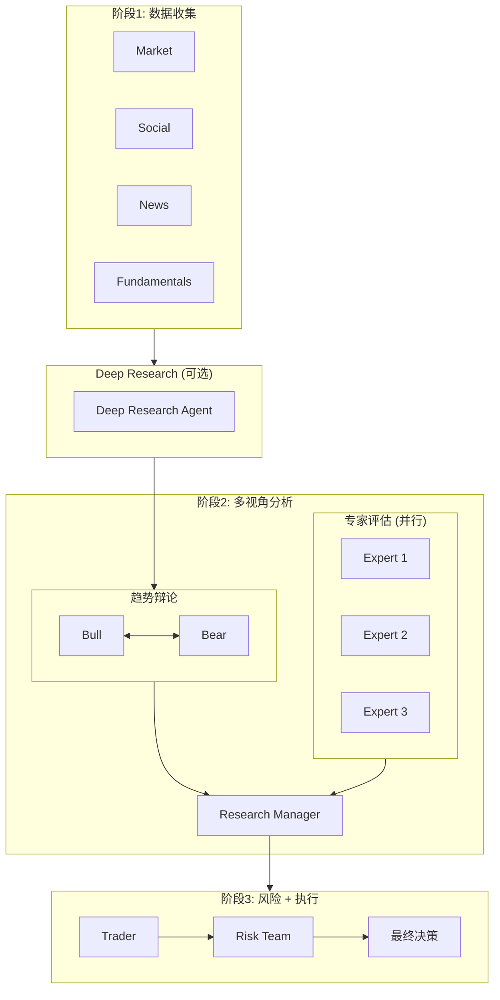

# Phase 3: Agent 升级实施计划

## 概述

Phase 3 聚焦于 Agent 系统的可扩展性升级，包括：
1. 可扩展专家框架（注册机制 + 动态选择器）
2. 首批 5 位专家 Agent
3. 动态收敛辩论机制
4. Deep Research 集成
5. 财报跟踪 Agent

## 前置修复

### Bug Fix: ConditionalLogic 配置传递

**问题**: `trading_graph.py:134` 实例化 `ConditionalLogic()` 时未传递 `max_debate_rounds` 和 `max_risk_discuss_rounds`。

**修复**:
```python
# trading_graph.py:134
self.conditional_logic = ConditionalLogic(
    max_debate_rounds=self.config.get("max_debate_rounds", 1),
    max_risk_discuss_rounds=self.config.get("max_risk_discuss_rounds", 1),
)
```

---

## 1. 可扩展专家框架

### 1.1 目录结构

```
tradingagents/
├── experts/
│   ├── __init__.py           # 导出注册器和所有专家
│   ├── registry.py           # 专家注册中心
│   ├── selector.py           # 动态专家选择器
│   ├── base.py               # 专家基类协议
│   └── investors/            # 具体专家实现
│       ├── __init__.py
│       ├── buffett.py
│       ├── munger.py
│       ├── lynch.py
│       ├── livermore.py
│       └── graham.py
```

### 1.2 核心接口设计

#### ExpertProfile (数据类)

```python
@dataclass
class ExpertProfile:
    id: str                      # 唯一标识: "buffett", "munger"
    name: str                    # 显示名: "Warren Buffett"
    philosophy: str              # 投资哲学简述
    applicable_sectors: list[str]  # 适用行业: ["consumer", "finance", "tech"]
    market_cap_preference: str   # "large", "mid", "small", "any"
    style: str                   # "value", "growth", "momentum", "contrarian"
    time_horizon: str            # "short", "medium", "long"
    factory: Callable            # 工厂函数
```

#### ExpertOutput (结构化输出)

```python
class ExpertOutput(TypedDict):
    recommendation: Literal["BUY", "SELL", "HOLD"]
    confidence: float            # 0.0 - 1.0
    time_horizon: str            # "short_term", "medium_term", "long_term"
    key_reasoning: list[str]     # 3-5 条核心论据
    risks: list[str]             # 主要风险点
    position_suggestion: float   # 建议仓位百分比 0-100
```

### 1.3 注册中心 (registry.py)

```python
class ExpertRegistry:
    _experts: dict[str, ExpertProfile] = {}
    
    @classmethod
    def register(cls, profile: ExpertProfile) -> None:
        """注册专家到全局注册表"""
        
    @classmethod
    def get(cls, expert_id: str) -> ExpertProfile:
        """获取指定专家"""
        
    @classmethod
    def list_all(cls) -> list[ExpertProfile]:
        """列出所有已注册专家"""
        
    @classmethod
    def filter_by(cls, sector: str = None, style: str = None) -> list[ExpertProfile]:
        """按条件筛选专家"""
```

### 1.4 动态选择器 (selector.py)

```python
class ExpertSelector:
    def __init__(self, config: dict):
        self.max_experts = config.get("max_experts", 3)
        self.selection_mode = config.get("expert_selection_mode", "auto")
        
    def select(
        self,
        ticker: str,
        stock_info: dict,  # 包含 sector, market_cap, volatility 等
        user_override: list[str] = None
    ) -> list[ExpertProfile]:
        """
        选择策略:
        1. user_override 非空时直接使用用户指定
        2. auto 模式: 根据股票特征匹配最适合的专家组合
        3. random 模式: 随机选择 (用于 A/B 测试)
        """
```

**选择规则表**:

| 股票特征 | 优先专家 | 理由 |
|---------|---------|------|
| 大盘蓝筹 + 消费 | Buffett, Munger | 护城河 + 多元思维 |
| 中小盘成长 | Lynch, Graham | GARP + 安全边际 |
| 高波动趋势 | Livermore, Lynch | 趋势 + 成长 |
| 低估值深度价值 | Graham, Buffett | 烟蒂股 + 价值 |

---

## 2. 专家 Agent 实现

### 2.1 专家工厂函数模式

遵循现有 `create_bull_researcher` 模式:

```python
def create_expert_agent(
    llm,
    memory: FinancialSituationMemory,
    profile: ExpertProfile
) -> Callable[[AgentState], dict]:
    """
    高阶工厂函数，返回专家节点闭包。
    """
    def expert_node(state: AgentState) -> dict:
        # 1. 提取 4 份分析师报告
        # 2. 检索历史记忆
        # 3. 构建专家特定 Prompt (含投资哲学)
        # 4. 调用 LLM
        # 5. 解析为 ExpertOutput
        # 6. 返回更新后的状态
        ...
    return expert_node
```

### 2.2 首批 5 位专家 Prompt 设计

| 专家 | 核心 Prompt 要素 |
|------|-----------------|
| **Buffett** | 护城河评估 (品牌/网络效应/成本优势)、管理层诚信、"wonderful company at fair price" |
| **Munger** | 多元思维模型检验、逆向思考 "invert, always invert"、避免愚蠢比追求聪明更重要 |
| **Lynch** | PEG 比率分析、"invest in what you know"、10-bagger 潜力评估 |
| **Livermore** | 关键价位识别、趋势确认、市场时机判断、止损纪律 |
| **Graham** | 安全边际计算、净流动资产价值、格雷厄姆数字公式 |

### 2.3 状态扩展

```python
# agent_states.py 新增
class ExpertEvaluationState(TypedDict):
    expert_id: str
    evaluation: ExpertOutput
    timestamp: str

# AgentState 扩展
class AgentState(MessagesState):
    # ... 现有字段 ...
    expert_evaluations: list[ExpertEvaluationState]  # 新增
```

---

## 3. 动态收敛辩论机制

### 3.1 收敛检测器

```python
# tradingagents/graph/convergence.py
class ConvergenceDetector:
    def __init__(self, config: dict):
        self.semantic_threshold = config.get("debate_semantic_threshold", 0.85)
        self.info_gain_threshold = config.get("debate_info_gain_threshold", 0.1)
        self.max_rounds = config.get("max_debate_rounds", 3)
        
    def should_stop(
        self,
        history: list[str],
        embeddings: list[list[float]] = None
    ) -> tuple[bool, str]:
        """
        返回 (是否停止, 停止原因)
        停止原因: "max_rounds" | "semantic_converged" | "info_gain_low"
        """
```

### 3.2 收敛指标

| 指标 | 计算方式 | 阈值 |
|------|---------|------|
| **语义收敛度** | 连续两轮 embedding 余弦相似度 | > 0.85 |
| **信息增益** | 新论据关键词占比 | < 0.1 |
| **最大轮次** | 硬性上限 | 3 轮 |

### 3.3 Embedding Provider 抽象

支持多种 embedding provider，与 LLM provider 模式一致:

```python
# tradingagents/embeddings/
├── __init__.py
├── base.py              # EmbeddingProvider 基类
├── sentence_transformers.py  # 本地 all-MiniLM-L6-v2
├── openai.py            # text-embedding-3-small
├── google.py            # text-embedding-004
└── litellm.py           # LiteLLM 统一接口

# base.py
class EmbeddingProvider(ABC):
    @abstractmethod
    def embed(self, texts: list[str]) -> list[list[float]]:
        """返回 embedding 向量列表"""
        
    @abstractmethod
    def similarity(self, text1: str, text2: str) -> float:
        """计算两段文本的余弦相似度"""
```

**配置**:
```python
"embedding_provider": "sentence_transformers",  # 默认本地
"embedding_model": "all-MiniLM-L6-v2",
```

### 3.3 ConditionalLogic 升级

```python
class ConditionalLogic:
    def __init__(self, config: dict):
        self.convergence_detector = ConvergenceDetector(config)
        # ...
        
    def should_continue_debate(self, state: AgentState) -> str:
        should_stop, reason = self.convergence_detector.should_stop(
            state["investment_debate_state"]["history"]
        )
        if should_stop:
            return "Research Manager"
        # ... 原有轮换逻辑 ...
```

---

## 4. Deep Research 集成

### 4.1 模块结构

```
tradingagents/
├── research/
│   ├── __init__.py
│   ├── deep_research.py      # 核心研究 Agent
│   └── providers/
│       ├── __init__.py
│       ├── gemini.py         # Gemini Deep Research (优先)
│       └── openai.py         # OpenAI Responses API (备选)
```

**Provider 优先级**: Gemini Deep Research > OpenAI Deep Research

### 4.2 触发条件

```python
class DeepResearchTrigger:
    """判断是否需要触发深度研究"""
    
    @staticmethod
    def should_trigger(state: AgentState, config: dict) -> bool:
        # 1. 用户手动请求: config.get("force_deep_research")
        # 2. 首次分析新股票: 无历史记忆
        # 3. 财报前 14 天: 通过 earnings_dates 判断
        # 4. 持仓重大波动: 需要 portfolio 数据
        pass
```

### 4.3 工作流位置

```
Analysts (4个) → [Deep Research Agent] → Bull/Bear Debate → ...
                    ↑ 可选阶段
```

### 4.4 AgentState 扩展

```python
class AgentState(MessagesState):
    # ... 现有字段 ...
    deep_research_report: str  # 新增: Deep Research 输出
    deep_research_sources: list[str]  # 新增: 引用来源
```

---

## 5. 财报跟踪 Agent

### 5.1 功能定义

```python
# tradingagents/agents/specialists/earnings_tracker.py
class EarningsTracker:
    """
    职责:
    1. 定期检查持仓股票的财报日期
    2. 财报前 14 天触发预警分析
    3. 财报后对比实际 vs 预期，更新建议
    """
    
    def check_upcoming_earnings(
        self,
        portfolio: list[str],
        lookahead_days: int = 14
    ) -> list[EarningsAlert]:
        """检查即将发布财报的股票"""
        
    def generate_pre_earnings_analysis(
        self,
        ticker: str,
        earnings_date: date
    ) -> str:
        """生成财报前分析报告"""
```

### 5.2 数据依赖

复用 Phase 2 实现的:
- `get_earnings_dates()` - 获取财报日期
- `get_fundamentals()` - 历史财务数据
- FRED 宏观数据 - 行业背景

---

## 6. 图编排更新

### 6.1 新工作流



### 6.2 关键修改文件

| 文件 | 修改内容 |
|------|---------|
| `trading_graph.py` | 初始化专家框架、传递 config 到 ConditionalLogic |
| `setup.py` | 添加专家节点、Deep Research 节点、条件边 |
| `conditional_logic.py` | 集成收敛检测器、新增专家路由方法 |
| `agent_states.py` | 扩展 AgentState 和新增 ExpertEvaluationState |
| `propagation.py` | 初始化专家评估状态 |
| `default_config.py` | 新增专家/Deep Research/收敛相关配置项 |

---

## 7. 配置项扩展

```python
# default_config.py 新增
DEFAULT_CONFIG = {
    # ... 现有配置 ...
    
    # 专家框架
    "experts_enabled": True,
    "max_experts": 3,
    "expert_selection_mode": "auto",  # "auto" | "manual" | "random"
    "selected_experts": None,  # 手动模式时指定: ["buffett", "munger"]
    
    # Embedding Provider (用于收敛检测)
    "embedding_provider": "sentence_transformers",  # "sentence_transformers" | "openai" | "google" | "litellm"
    "embedding_model": "all-MiniLM-L6-v2",  # provider 特定模型名
    
    # 动态收敛
    "debate_convergence_enabled": True,
    "debate_semantic_threshold": 0.85,
    "debate_info_gain_threshold": 0.1,
    "max_debate_rounds": 3,
    
    # Deep Research
    "deep_research_enabled": False,  # 默认关闭，按需开启
    "deep_research_provider": "gemini",  # "gemini" (优先) | "openai"
    "deep_research_triggers": ["first_analysis", "pre_earnings"],
    
    # 财报跟踪
    "earnings_tracking_enabled": True,
    "earnings_lookahead_days": 14,
}
```

---

## 8. 实施步骤

### Step 1: 前置修复 + 基础架构
1. 修复 ConditionalLogic 配置传递 bug
2. 创建 `experts/` 目录结构
3. 实现 `ExpertProfile`, `ExpertOutput`, `ExpertRegistry`

### Step 2: 专家 Agent 实现
1. 实现 `create_expert_agent` 工厂函数
2. 实现 5 位专家的 Prompt 和 Profile
3. 扩展 `AgentState` 添加 `expert_evaluations`

### Step 3: 专家选择器 + 图集成
1. 实现 `ExpertSelector`
2. 更新 `setup.py` 添加专家节点
3. 更新 `conditional_logic.py` 添加专家路由

### Step 4: 动态收敛机制
1. 实现 `ConvergenceDetector`
2. 集成到 `should_continue_debate`
3. 配置化阈值参数

### Step 5: Deep Research (可选)
1. 创建 `research/` 目录
2. 实现 OpenAI/Gemini provider
3. 添加触发条件逻辑
4. 集成到工作流

### Step 6: 财报跟踪
1. 实现 `EarningsTracker` 类
2. 集成 Phase 2 的 `get_earnings_dates`
3. 添加预警生成逻辑

### Step 7: 验证
1. 单元测试专家注册和选择
2. 端到端测试完整工作流
3. 验证收敛检测效果

---

## 9. 验证方案

### 单元测试
- 专家注册/发现/选择逻辑
- 收敛检测器各种边界条件
- ExpertOutput 结构化解析

### 集成测试
```bash
# 测试专家框架
python -c "
from tradingagents.experts import ExpertRegistry, ExpertSelector
print(ExpertRegistry.list_all())
"

# 端到端测试
python -c "
from tradingagents import TradingAgentsGraph
graph = TradingAgentsGraph(config={'experts_enabled': True})
state, signal = graph.propagate('AAPL', '2024-01-15')
print('Expert evaluations:', state.get('expert_evaluations'))
"
```

### 验收标准
- [ ] 5 位专家成功注册并可被发现
- [ ] 动态选择器根据股票特征选择合适专家
- [ ] 辩论在语义收敛时提前停止
- [ ] Research Manager 综合专家意见裁决
- [ ] 财报跟踪检测到即将发布的财报

---

## 10. 风险与缓解

| 风险 | 缓解措施 |
|------|---------|
| 专家并行执行增加 Token 成本 | 可配置 `max_experts` 限制数量 |
| 收敛检测需要 embedding 计算 | 使用轻量 embedding 模型或缓存 |
| Deep Research API 响应慢 | 异步执行 + 超时控制 |
| 专家意见冲突 | Research Manager 综合加权裁决 |
