# TradingAgents 架构分析与升级方案

## 项目概览

**项目**: TradingAgents - 多智能体LLM金融交易框架  
**核心架构**: LangGraph编排 + 10个专业Agent + ChromaDB记忆  
**数据源**: YFinance, Finnhub, Reddit, Google News, SimFin  

---

## 一、当前架构（As-Is）

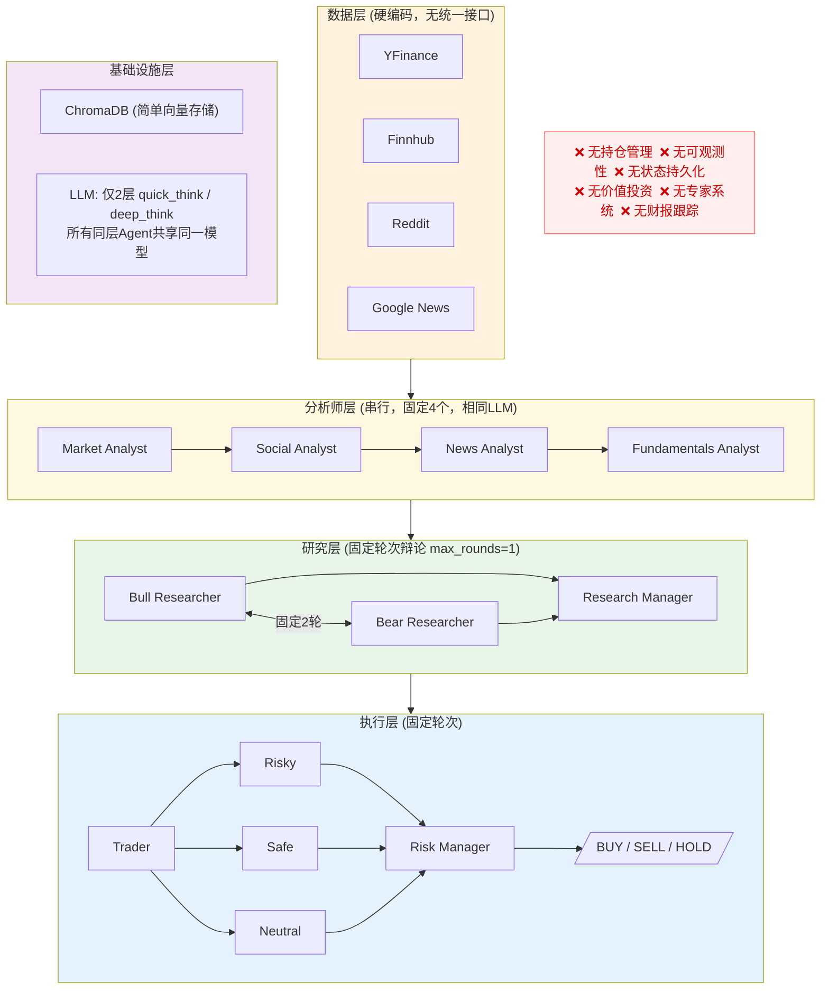

**核心局限**:
- 分析师固定4个，串行执行，无法扩展
- 辩论机制简单，固定轮次，无收敛检测
- 仅2层模型（quick/deep），所有同层Agent共用
- 无价值投资分析、无专家视角
- 无持仓管理、无交易记录
- 无可观测性、无Prompt版本管理

---

## 二、目标架构（To-Be）

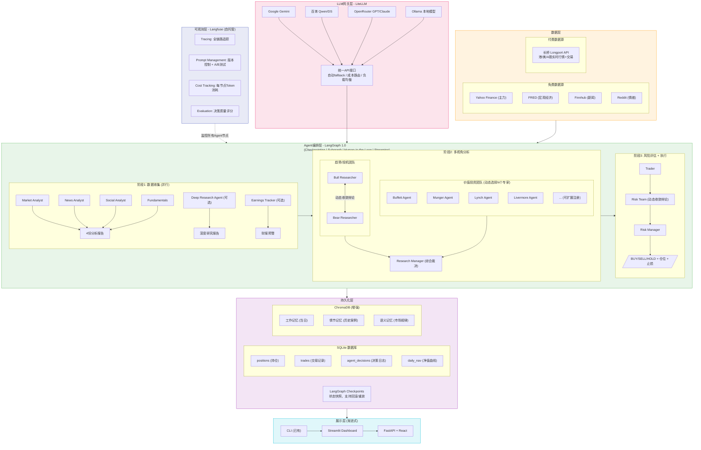

---

## 三、分层模型策略（LLM网关）

### 3.1 设计原则

- 每个Agent节点可**独立配置**最佳模型，不限于特定厂商
- 通过LiteLLM网关统一管理Google Pro、百炼、OpenRouter等多平台
- 支持**fallback链**：首选模型失败时自动降级
- 支持**成本路由**：优先使用免费额度，超额后切换低价模型
- 后续收益稳定后可**一键切换**全部使用最佳模型

### 3.2 节点-模型映射（可配置，非固定）

每个节点定义一个**角色类型**（role_type），通过配置文件映射到具体模型。

**当前可用模型池** (截至2026年2月):

| 平台 | 轻量/快速模型 | 标准模型 | 旗舰/推理模型 |
|------|-------------|---------|-------------|
| **Google** | Gemini 3 Flash | Gemini 3 Pro | Gemini 3.1 Pro, Gemini 3 Deep Think |
| **百炼/Qwen** | Qwen3-Turbo | Qwen3-Max | Qwen3.5-Plus (397B) |
| **OpenAI** | GPT-4.5-mini | GPT-4.5 | GPT-5.2 Codex, o4-mini, o3 |
| **Anthropic** | Claude Haiku 4 | Claude Sonnet 4 | Claude Opus 4.5 |
| **DeepSeek** | DeepSeek-V3.2 | DeepSeek-V3.2 | DeepSeek-R2 Pro |
| **Meta (本地)** | Llama 4 (8B) | Llama 4 (70B) | Llama 4 (405B) |

| 角色类型 | 任务特征 | 推荐模型层级 |
|----------|----------|-------------|
| `data_analyst` | 数据处理、摘要 | 轻量模型 (低成本高速) |
| `researcher` | 论证、分析 | 标准模型 |
| `expert` | 投资哲学推理 | 标准~旗舰模型 |
| `judge` | 综合裁决 | 旗舰模型 |
| `critical_decision` | 最终风险决策 | 推理模型 (o3/Deep Think/R2) |

### 3.3 配置方式

通过YAML配置文件管理，不硬编码在代码中：

```yaml
# model_routing.yaml

# ===== 模型别名定义 =====
# 所有profile通过别名引用模型，新模型上线只需修改此处
model_aliases:
  # --- 轻量级 ---
  gemini_flash: "gemini/gemini-3-flash"
  qwen_turbo: "dashscope/qwen3-turbo"
  gpt_mini: "openrouter/openai/gpt-4.5-mini"
  haiku: "openrouter/anthropic/claude-haiku-4"
  deepseek_v3: "openrouter/deepseek/deepseek-v3.2"
  # --- 标准级 ---
  gemini_pro: "gemini/gemini-3-pro"
  qwen_max: "dashscope/qwen3-max"
  gpt_std: "openrouter/openai/gpt-4.5"
  sonnet: "openrouter/anthropic/claude-sonnet-4"
  # --- 旗舰/推理 ---
  gemini_top: "gemini/gemini-3.1-pro"
  gemini_think: "gemini/gemini-3-deep-think"
  qwen_plus: "dashscope/qwen3.5-plus"
  gpt_reasoning: "openrouter/openai/o4-mini"
  gpt_top: "openrouter/openai/o3"
  opus: "openrouter/anthropic/claude-opus-4.5"
  deepseek_r2: "openrouter/deepseek/deepseek-r2-pro"

# ===== 角色-模型映射 Profiles =====
profiles:
  cost_saving:  # 省钱模式 (优先免费额度)
    data_analyst: "${gemini_flash}"
    researcher: "${qwen_turbo}"
    expert: "${gemini_pro}"
    judge: "${qwen_max}"
    critical_decision: "${gpt_reasoning}"
    fallback_chain: ["${deepseek_v3}", "${qwen_turbo}"]

  balanced:  # 平衡模式
    data_analyst: "${gemini_flash}"
    researcher: "${sonnet}"
    expert: "${gemini_pro}"
    judge: "${gpt_std}"
    critical_decision: "${gpt_reasoning}"
    fallback_chain: ["${qwen_max}", "${gemini_pro}"]

  best_quality:  # 最佳质量模式
    data_analyst: "${gpt_std}"
    researcher: "${opus}"
    expert: "${gemini_top}"
    judge: "${gpt_top}"
    critical_decision: "${gpt_top}"
    fallback_chain: ["${opus}", "${gemini_think}"]

active_profile: "balanced"
```

### 3.4 模型生命周期管理

模型迭代速度极快（每1-2个月有新模型发布），需要一套机制确保系统持续使用最优模型：

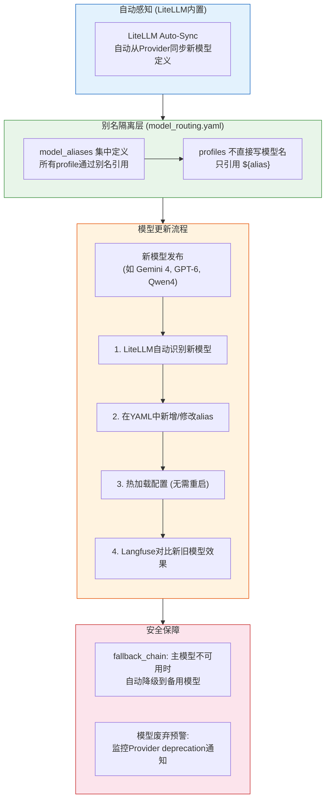

**核心设计**: 三层解耦

| 层 | 职责 | 新模型时需要做什么 |
|----|------|-------------------|
| **LiteLLM层** | 与Provider API通信 | 无需操作，自动同步 |
| **别名层** (model_aliases) | 将模型名映射为语义化别名 | 修改1行YAML |
| **Profile层** (profiles) | 角色到别名的映射 | 通常无需修改 |

**更新模型只需改一处**: 例如 Gemini 4 发布后，只需将 `gemini_pro: "gemini/gemini-3-pro"` 改为 `gemini_pro: "gemini/gemini-4-pro"`，所有引用该别名的profile自动生效。

**LiteLLM 热加载**: 支持通过 API 调用 `/model/update` 动态更新模型配置，无需重启服务。

### 3.4 LLM网关架构

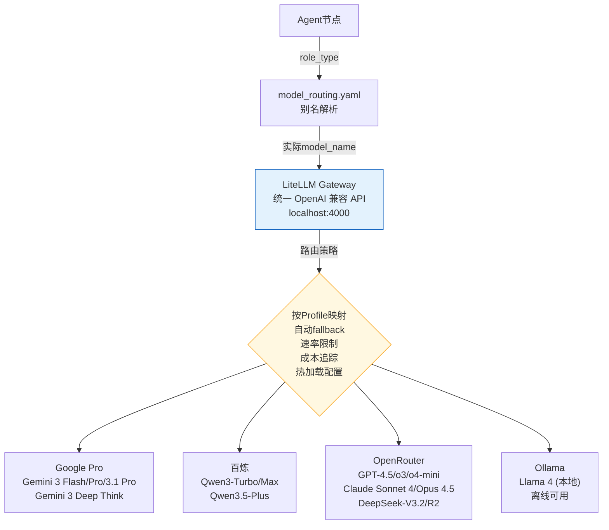

---

## 四、可扩展专家智能体框架

### 4.1 设计原则

- **注册机制**: 专家以插件形式注册到系统，新增专家无需修改核心代码
- **动态选择**: 根据股票特征（行业、市值、波动率等）自动选择最适合的专家组合
- **可配置数量**: 每次分析可选择2-5个专家，而非固定组合
- **统一接口**: 所有专家遵循相同的输入输出协议

### 4.2 专家注册与发现架构

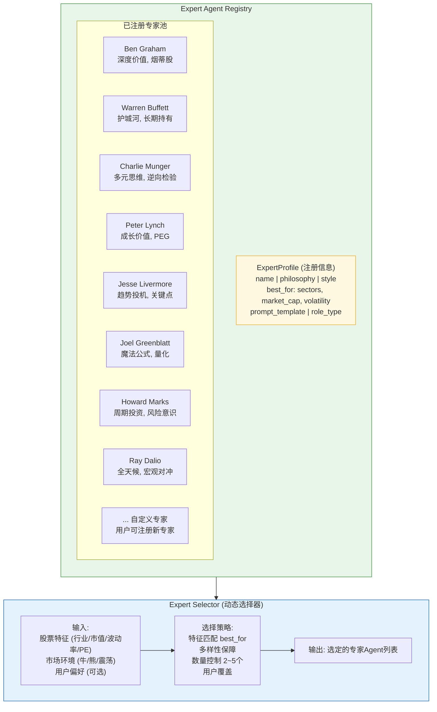

### 4.3 动态选择示例

| 场景 | 股票 | 自动选择的专家 | 理由 |
|------|------|----------------|------|
| 大盘蓝筹 | AAPL | Buffett, Munger, Lynch | 护城河+多元思维+成长 |
| 周期股 | CAT | Marks, Greenblatt, Graham | 周期意识+量化+安全边际 |
| 高波动成长 | TSLA | Livermore, Lynch, Dalio | 趋势+成长+宏观 |
| 低估值小盘 | XYZ | Graham, Greenblatt, Lynch | 深度价值+魔法公式+挖掘 |
| 用户指定 | 任意 | 用户选择 | 完全自定义 |

### 4.4 专家统一接口协议

每个专家Agent遵循统一的输入/输出协议:

**输入**:
- 4份分析师报告（技术/情绪/新闻/基本面）
- 股票基础数据（价格、估值指标、财务数据）
- 历史记忆（该专家过去对类似情况的分析）

**输出** (结构化JSON):
- `recommendation`: BUY / SELL / HOLD
- `confidence`: 0.0 ~ 1.0
- `time_horizon`: short_term / medium_term / long_term
- `key_reasoning`: 核心论据（3-5条）
- `risks`: 主要风险点
- `position_suggestion`: 仓位建议百分比

---

## 五、增强辩论机制

### 5.1 当前 vs 升级

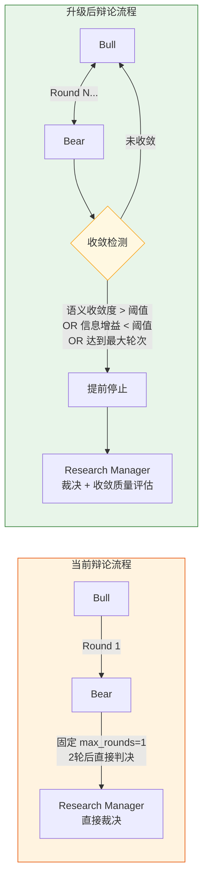

### 5.2 辩论质量指标

| 指标 | 描述 | 用途 |
|------|------|------|
| **语义收敛度** | 连续轮次观点embedding的余弦相似度 | 判断是否继续辩论 |
| **信息增益** | 新轮次引入的新论据/数据占比 | 判断辩论是否有效 |
| **极化程度** | Bull和Bear信号分数的差距 | 检测是否陷入极端 |
| **引用密度** | 引用原始数据的频率 | 评估论证质量 |

---

## 六、数据源升级

### 6.1 数据源架构

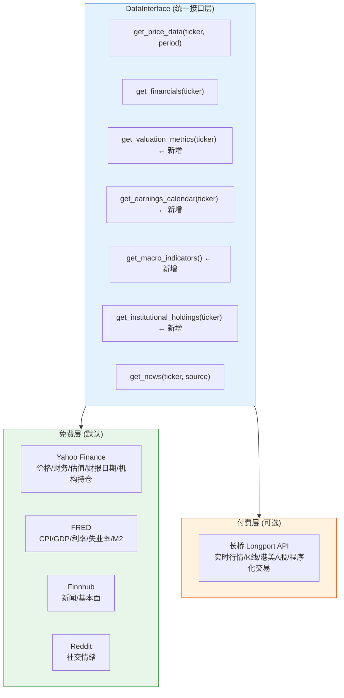

### 6.2 新增数据能力

| 能力 | 数据源 | 用途 |
|------|--------|------|
| **财报日历** | Yahoo Finance earnings_dates | 财报跟踪Agent |
| **估值指标** | Yahoo Finance info (P/E, P/B, EV/EBITDA) | 价值投资分析 |
| **机构持仓** | Yahoo Finance institutional_holders | 资金流向判断 |
| **宏观经济** | FRED API (CPI, GDP, 利率曲线) | 宏观环境判断 |
| **实时行情** | 长桥 QuoteContext | 盘中交易信号 |

---

## 七、价值投资框架

### 7.1 价值投资分析流程图

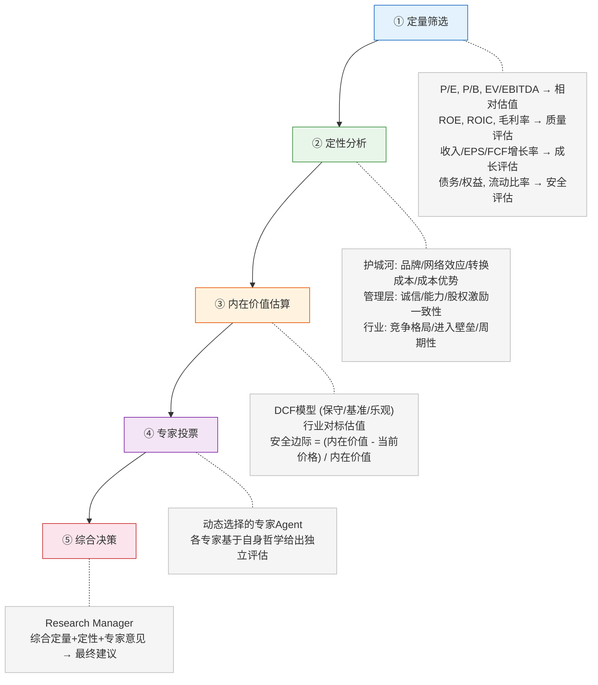

### 7.2 财报跟踪功能

**目标**: 自动监控持仓和关注列表的财报发布时间，在财报前自动触发深度分析

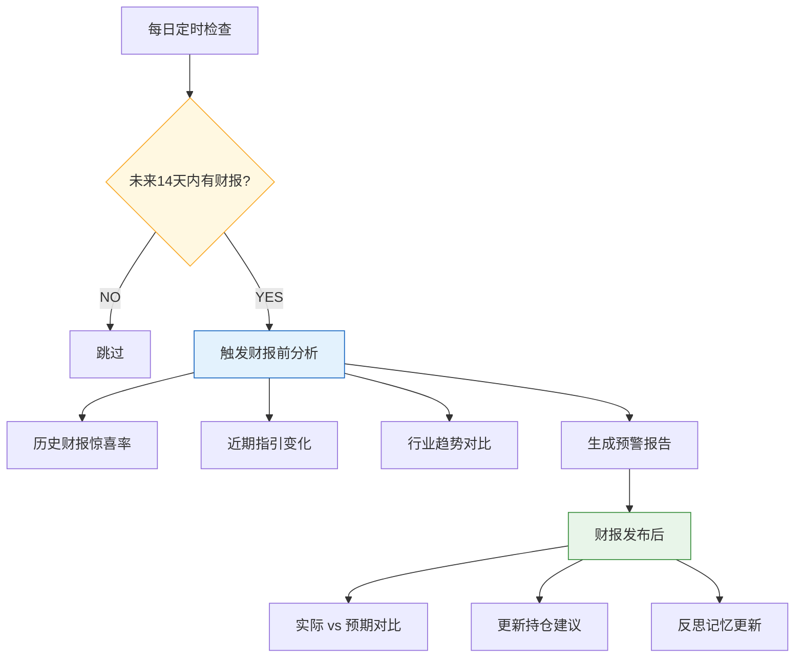

---

## 八、Deep Research集成

### 8.1 Deep Research在交易流程中的位置

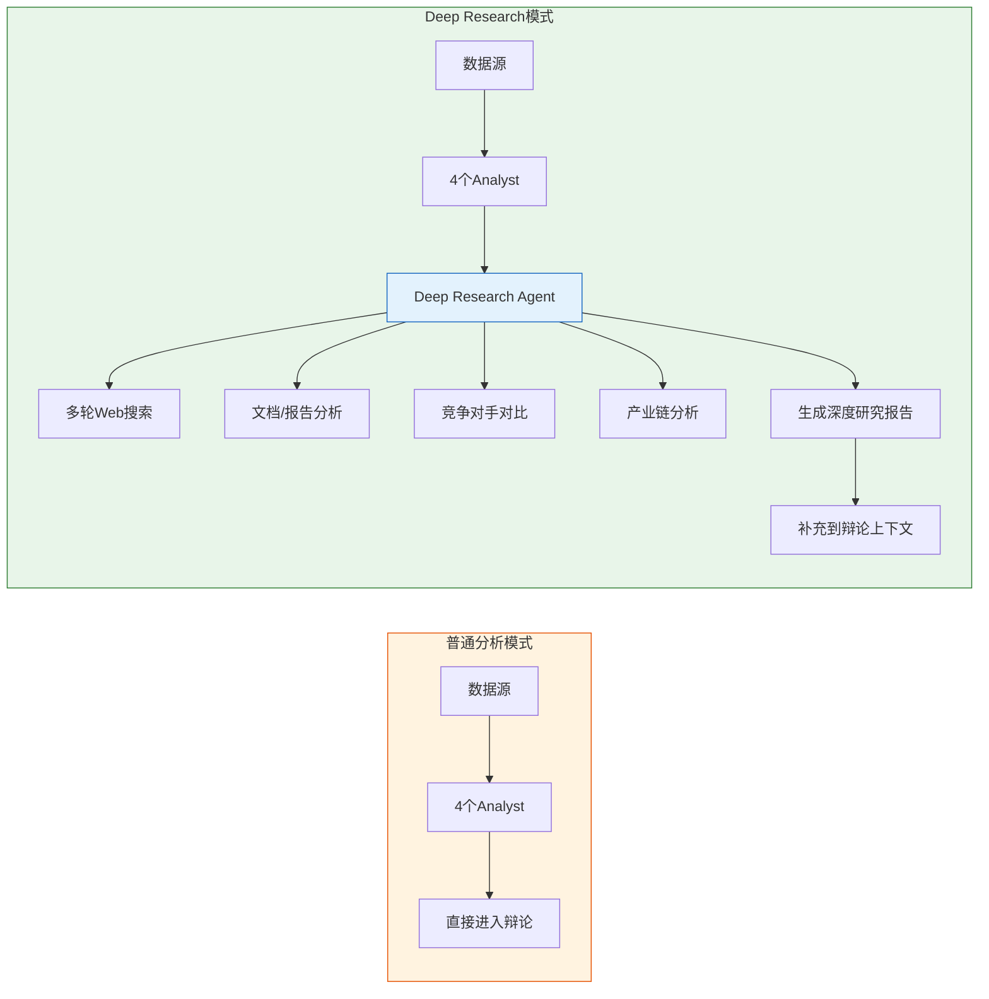

**参考实现**: `langchain-ai/open_deep_research` (LangGraph原生)

**触发条件**:
- 用户手动请求深度研究
- 首次分析某只新股票
- 财报前深度调研
- 持仓出现重大波动

---

## 九、持仓管理与数据库

### 9.1 数据库架构

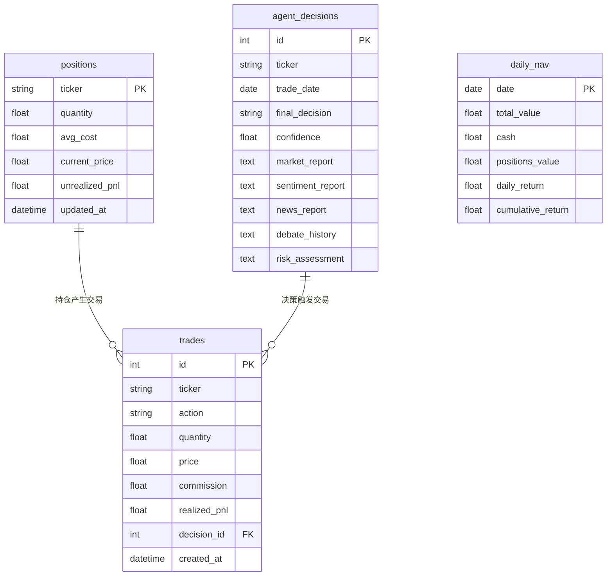

### 9.2 渐进式升级路径

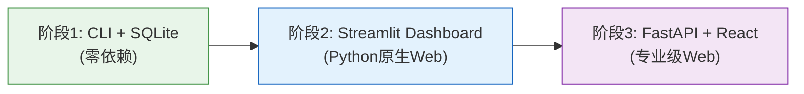

---

## 十、可观测性方案

### 10.1 Langfuse集成架构

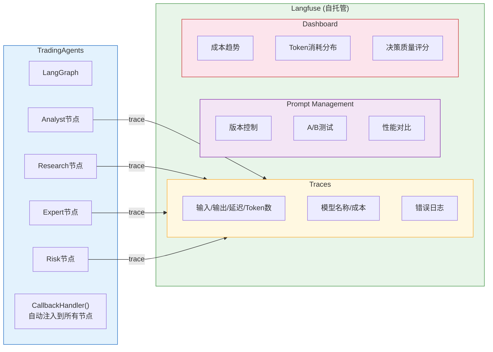

---

## 十一、开源项目复用清单

| 需求 | 推荐项目 | 复用方式 |
|------|----------|----------|
| 投资大师Agent Prompt | virattt/ai-hedge-fund | 复用Prompt设计，扩展为注册式框架 |
| Deep Research | langchain-ai/open_deep_research | 集成为子模块 |
| 持仓管理Schema | evancole99/investment_tracker | 参考数据库设计 |
| LLM网关 | litellm | 直接使用，配置多平台路由 |
| 可观测性 | langfuse (自托管) | Docker部署，集成Callback |
| 技术指标扩展 | bukosabino/ta | 扩充当前stockstats |

---

## 十二、实施路线图

### 阶段0: 环境准备
- [ ] 升级LangGraph到1.0
- [ ] 部署LiteLLM网关 + 配置多平台密钥
- [ ] 部署Langfuse自托管实例
- [ ] 设置SQLite数据库

### 阶段1: 核心架构升级
- [ ] LangGraph 1.0 Checkpointing集成
- [ ] Langfuse追踪回调接入
- [ ] LiteLLM分层模型配置（YAML配置化）
- [ ] 持仓管理数据库实现
- [ ] 重构 `trading_graph.py` 支持模型路由

### 阶段2: 数据源升级
- [ ] Yahoo Finance增强（财报日期、估值指标、机构持仓）
- [ ] 长桥Longport API集成
- [ ] FRED宏观经济数据接入

### 阶段3: Agent升级
- [ ] 可扩展专家框架（注册机制 + 动态选择器）
- [ ] 首批专家Agent: Buffett, Munger, Lynch, Livermore, Graham
- [ ] 动态收敛辩论机制
- [ ] Deep Research集成（基于open_deep_research）
- [ ] 财报跟踪Agent

### 阶段4: 价值投资框架
- [ ] DCF估值模型
- [ ] 护城河评估模块
- [ ] 安全边际计算
- [ ] 价值投资决策流程集成

### 阶段5: 优化与测试
- [ ] Token成本优化验证
- [ ] 回测框架
- [ ] 端到端测试
- [ ] Streamlit Dashboard（可选）

---

## 关键改造文件

| 文件 | 改造内容 | 优先级 |
|------|----------|--------|
| `tradingagents/graph/trading_graph.py` | LangGraph 1.0升级、Checkpointing、LiteLLM | P0 |
| `tradingagents/graph/setup.py` | 模型路由配置、新Agent节点、并行执行 | P0 |
| `tradingagents/default_config.py` | LiteLLM/Langfuse配置项、模型profile | P0 |
| `tradingagents/graph/conditional_logic.py` | 动态收敛辩论逻辑 | P1 |
| `tradingagents/dataflows/interface.py` | 长桥/FRED/YFinance增强 | P1 |
| `tradingagents/agents/utils/memory.py` | 分层记忆架构 | P1 |
| 新增 `tradingagents/experts/` | 专家注册框架 + 专家Agent定义 | P1 |
| 新增 `tradingagents/database/` | SQLite Schema和ORM | P1 |
| 新增 `tradingagents/research/` | Deep Research模块 | P2 |
| 新增 `tradingagents/valuation/` | 价值投资指标计算 | P2 |
| 新增 `model_routing.yaml` | 分层模型配置 | P0 |

---

## 验证方案

- **LLM网关**: 验证各平台模型通过LiteLLM正常响应
- **数据库**: 验证SQLite Schema创建和CRUD操作
- **数据源**: 验证YFinance增强数据和长桥API连通性
- **专家框架**: 验证专家注册、发现、动态选择流程
- **辩论机制**: 验证收敛检测在不同场景下的表现
- **端到端**: 对AAPL执行完整分析流程，检查各环节输出
- **成本追踪**: 在Langfuse中验证Token消耗统计

---

## 成本预算（月度）

| 项目 | 预估成本 | 备注 |
|------|----------|------|
| LLM API（分层优化） | $20-50 | Gemini免费额度 + 百炼 + OpenRouter |
| 长桥行情 | 免费~$99 | Level 1免费 |
| Langfuse | 免费 | 自托管 |
| **总计** | **$20-150/月** | 省钱模式约$20，平衡模式约$50 |
