# TradingAgents 架构分析与升级方案

## 项目概览

**项目**: TradingAgents - 多智能体LLM金融交易框架
**核心架构**: LangGraph编排 + 12个专业Agent + BM25记忆
**数据源**: YFinance, Alpha Vantage
**LLM支持**: OpenAI, Anthropic, Google Gemini, Ollama, OpenRouter

### 技术栈

| 组件 | 技术选型 | 版本要求 |
|------|---------|---------|
| **工作流编排** | LangGraph StateGraph | >= 0.4.8 |
| **LLM 框架** | LangChain (openai/anthropic/google-genai) | 多版本 |
| **记忆检索** | BM25 (rank_bm25, 内存模式) | - |
| **回测** | Backtrader (仅依赖，未集成) | - |
| **数据源** | Yahoo Finance, Alpha Vantage | - |
| **UI** | Rich CLI (Typer + Rich + Questionary) | - |

### 核心模块与文件

| 模块 | 关键文件 | 职责 |
|------|---------|------|
| **图编排** | `tradingagents/graph/trading_graph.py` (283行) | 主Orchestrator，初始化LLM/记忆/工具/图 |
| **图设置** | `tradingagents/graph/setup.py` (202行) | 构建LangGraph StateGraph，定义节点和边 |
| **条件逻辑** | `tradingagents/graph/conditional_logic.py` (67行) | 控制辩论轮次、工具调用循环 |
| **信号处理** | `tradingagents/graph/signal_processing.py` | 从详细报告提取BUY/SELL/HOLD |
| **反思学习** | `tradingagents/graph/reflection.py` (121行) | 基于实际收益进行事后反思 |
| **分析师** | `tradingagents/agents/analysts/*.py` (4个) | Market / Social / News / Fundamentals |
| **研究员** | `tradingagents/agents/researchers/*.py` (2个) | Bull / Bear Researcher |
| **风险管理** | `tradingagents/agents/risk_mgmt/*.py` (3个) | Aggressive / Conservative / Neutral |
| **管理层** | `tradingagents/agents/managers/*.py` (2个) | Research Manager / Risk Manager |
| **交易员** | `tradingagents/agents/trader/trader.py` | 生成交易提案 |
| **记忆系统** | `tradingagents/agents/utils/memory.py` (144行) | BM25词法相似度记忆 |
| **工具箱** | `tradingagents/agents/utils/agent_utils.py` (37行) + `*_tools.py` (4个文件) | 聚合层 + 9个@tool方法分布于独立工具模块 |
| **配置** | `tradingagents/default_config.py` | 全局配置（LLM/辩论轮数/工具模式） |

### 完整执行流程

```
START
  → Market Analyst (串行) → tools_market → Msg Clear
  → Social Analyst (串行) → tools_social → Msg Clear
  → News Analyst (串行) → tools_news → Msg Clear
  → Fundamentals Analyst (串行) → tools_fundamentals → Msg Clear
  → Bull Researcher ⇄ Bear Researcher (max_debate_rounds=1, 共2轮)
  → Research Manager (deep_thinking_llm 裁判)
  → Trader (生成交易提案)
  → Risky Analyst → Safe Analyst → Neutral Analyst (max_risk_discuss_rounds=1, 共3轮)
  → Risk Judge (deep_thinking_llm 最终裁判)
  → SignalProcessor 提取 BUY/SELL/HOLD
END
```

---

## 一、当前架构（As-Is）

> D2架构图: [`docs/arch/01-current-architecture.d2`](../../docs/arch/01-current-architecture.d2)

**核心局限**:
- 分析师固定4个，串行执行，无法扩展
- 辩论机制简单，固定轮次，无收敛检测
- 仅2层模型（quick/deep），所有同层Agent共用
- 无价值投资分析、无专家视角
- 无持仓管理、无交易记录
- 无可观测性、无Prompt版本管理

### 1.1 Prompt设计局限性

| 问题点 | 描述 | 优先级 | 复杂度 |
|--------|------|--------|--------|
| **静态模板化Prompt** | 所有Agent使用硬编码系统提示词，无动态上下文适配 | P1 | 中 |
| **缺少Few-shot示例** | Prompt中未嵌入高质量交易决策示例，依赖零样本推理 | P1 | 低 |
| **角色定义模糊** | Bull/Bear研究员侧重"辩论"而非"风险量化"，易导致情绪化论证 | P0 | 中 |
| **无结构化输出约束** | Agent输出为自由文本，缺少JSON Schema约束 | P1 | 低 |
| **缺少思维链引导** | 未使用CoT引导推理步骤，复杂决策透明度低 | P2 | 低 |
| **ReAct范式缺失** | 工具调用与推理割裂，无"观察→思考→行动"循环 | P1 | 中 |

**关键代码证据**:
- `bull_researcher.py:25-43`: Prompt是大字符串直接拼接所有报告，无结构化推理指引
- `market_analyst.py:24-50`: 技术指标说明详尽但缺少分析方法论
- `reflection.py:17-47`: 反思有一定结构，但仅限事后反思

### 1.2 与前沿AI Trading研究的差距

| 研究前沿 | 当前实现 | 差距 | 优先级 |
|----------|----------|------|--------|
| **FinGPT范式** | 无领域持续预训练 | 未使用金融语料微调LLM | P2 |
| **AlphaSignal方法** | 无信号融合框架 | Agent输出未量化为标准化信号（-1到+1） | P0 |
| **Reflection机制** | 简单成功/失败反思 | 未实现迭代改进（如Self-RAG） | P1 |
| **多模态分析** | 纯文本处理 | 未整合K线图、财报图表等视觉信息 | P2 |
| **因果推断** | 相关性分析 | 未区分相关性与因果性 | P1 |
| **不确定性量化** | 无置信度输出 | 决策为确定性的BUY/SELL/HOLD | P1 |
| **市场Regime识别** | 无市场状态分类 | 无Regime Switching模型 | P1 |

### 1.3 记忆系统局限性

| 问题点 | 描述 | 优先级 |
|--------|------|--------|
| **简单词法检索** | 仅使用BM25词频匹配，无语义理解、无时间衰减、无重要性加权 | P1 |
| **无分层记忆** | 混合短期交易记忆与长期市场规律 | P1 |
| **非持久化** | 内存列表存储(`self.documents`)，重启即丢失 | P0 |
| **记忆隔离** | 5个Agent记忆完全隔离，无跨Agent知识共享 | P1 |

---

## 二、目标架构（To-Be）

> D2架构图: [`docs/arch/02-target-architecture.d2`](../../docs/arch/02-target-architecture.d2)

### 2.1 新Agent集成策略（代码级分析结论）

基于对 `setup.py`、`conditional_logic.py`、`agent_states.py` 的代码审查，新Agent**不能替换**现有节点，必须**新增**：

| 新Agent | 替换现有? | 集成方式 | 代码层面原因 |
|---------|----------|---------|-------------|
| **Expert Team**<br>(Buffett/Munger/Lynch等) | **否** | 新增"价值队伍"并行节点 | `InvestDebateState` 硬编码 `bull_history`/`bear_history` 二元结构；<br>`should_continue_debate()` 硬编码 Bull↔Bear 路由；<br>Expert做独立评估 ≠ 对抗性辩论 |
| **Deep Research** | **否** | 新增POST-STAGE节点 | 4个Analyst各有专项工具链（YFinance/Alpha Vantage），功能互补非重叠；<br>Deep Research做综合交叉验证，可引用4份报告增强深度 |

### 2.2 升级后工作流


### 2.3 关键状态变更

| 修改项 | 文件 | 变更 |
|--------|------|------|
| `AgentState` 新增字段 | `agents/utils/agent_states.py` | `deep_research_report: str`<br>`expert_evaluations: dict` |
| `InvestDebateState` 扩展 | `agents/utils/agent_states.py` | `expert_team: dict` (不修改现有bull/bear字段) |
| `ConditionalLogic` 新方法 | `graph/conditional_logic.py` | `should_route_to_experts()`: 辩论结束后路由到Expert Team |
| `setup_graph()` 新节点 | `graph/setup.py` | 添加Deep Research节点 + 4个Expert节点 + 边定义 |
| `Research Manager` Prompt | `agents/managers/research_manager.py` | 判决时同时考虑 Bull/Bear辩论 + Expert独立评估 |

目标架构核心变化:
- **可观测层**: Langfuse自托管，全链路追踪 + Prompt版本管理 + 成本追踪
- **LLM网关层**: LiteLLM统一多平台（Google/百炼/OpenRouter/Ollama），自动fallback + 成本路由
- **数据层**: 免费(YFinance+FRED+Finnhub+Reddit) + 付费(长桥Longport)
- **编排层**: LangGraph 1.0 (Checkpointing/Subgraph/Streaming)
  - 阶段1: 数据收集（并行Analyst + Deep Research + Earnings Tracker）
  - 阶段2: 多视角分析（趋势团队Bull/Bear + **价值投资团队Buffett/Munger/Lynch/Livermore** + Research Manager综合裁决）
  - 阶段3: 风险评估 + 执行（输出方向+仓位+止损）
- **持久化层**: SQLite(持仓/交易/决策/净值) + ChromaDB增强(工作/情节/语义三层记忆) + Checkpoints
- **展示层**: CLI → Streamlit → FastAPI+React（渐进式）

---

## 三、分层模型策略（LLM网关）

### 3.1 设计原则

- 每个Agent节点可**独立配置**最佳模型，不限于特定厂商
- 通过LiteLLM网关统一管理Google Pro、百炼、OpenRouter等多平台
- 支持**fallback链**：首选模型失败时自动降级
- 支持**成本路由**：优先使用免费额度，超额后切换低价模型

### 3.2 节点-模型映射（可配置）

| 平台 | 轻量/快速模型 | 标准模型 | 旗舰/推理模型 |
|------|-------------|---------|-------------|
| **Google** | Gemini 3 Flash | Gemini 3 Pro | Gemini 3.1 Pro, Gemini 3 Deep Think |
| **百炼/Qwen** | Qwen3-Turbo | Qwen3-Max | Qwen3.5-Plus (397B) |
| **OpenAI** | GPT-4.5-mini | GPT-4.5 | GPT-5.2 Codex, o4-mini, o3 |
| **Anthropic** | Claude Haiku 4 | Claude Sonnet 4 | Claude Opus 4.5 |
| **DeepSeek** | DeepSeek-V3.2 | DeepSeek-V3.2 | DeepSeek-R2 Pro |
| **Meta (本地)** | Llama 4 (8B) | Llama 4 (70B) | Llama 4 (405B) |

| 角色类型 | 任务特征 | 推荐模型层级 |
|----------|----------|-------------|
| `data_analyst` | 数据处理、摘要 | 轻量模型 (低成本高速) |
| `researcher` | 论证、分析 | 标准模型 |
| `expert` | 投资哲学推理 | 标准~旗舰模型 |
| `judge` | 综合裁决 | 旗舰模型 |
| `critical_decision` | 最终风险决策 | 推理模型 (o3/Deep Think/R2) |

### 3.3 配置方式

通过YAML配置文件管理，不硬编码在代码中：

```yaml
# model_routing.yaml
model_aliases:
  gemini_flash: "gemini/gemini-3-flash"
  qwen_turbo: "dashscope/qwen3-turbo"
  gemini_pro: "gemini/gemini-3-pro"
  gpt_reasoning: "openrouter/openai/o4-mini"
  # ...

profiles:
  cost_saving:
    data_analyst: "${gemini_flash}"
    researcher: "${qwen_turbo}"
    expert: "${gemini_pro}"
    judge: "${qwen_max}"
    critical_decision: "${gpt_reasoning}"
    fallback_chain: ["${deepseek_v3}", "${qwen_turbo}"]

  balanced:
    data_analyst: "${gemini_flash}"
    researcher: "${sonnet}"
    expert: "${gemini_pro}"
    judge: "${gpt_std}"
    critical_decision: "${gpt_reasoning}"

  best_quality:
    data_analyst: "${gpt_std}"
    researcher: "${opus}"
    expert: "${gemini_top}"
    judge: "${gpt_top}"
    critical_decision: "${gpt_top}"

active_profile: "balanced"
```

### 3.4 模型生命周期管理


**核心设计**: 三层解耦

| 层 | 职责 | 新模型时需要做什么 |
|----|------|-------------------|
| **LiteLLM层** | 与Provider API通信 | 无需操作，自动同步 |
| **别名层** (model_aliases) | 将模型名映射为语义化别名 | 修改1行YAML |
| **Profile层** (profiles) | 角色到别名的映射 | 通常无需修改 |

### 3.5 LLM网关架构


---

## 四、可扩展专家智能体框架

### 4.1 设计原则

- **注册机制**: 专家以插件形式注册到系统，新增专家无需修改核心代码
- **动态选择**: 根据股票特征（行业、市值、波动率等）自动选择最适合的专家组合
- **可配置数量**: 每次分析可选择2-5个专家，而非固定组合
- **统一接口**: 所有专家遵循相同的输入输出协议

### 4.2 专家注册与发现架构

> D2架构图: [`docs/arch/03-expert-registry.d2`](../../docs/arch/03-expert-registry.d2)

**已注册专家池**:

| 专家 | 投资哲学 | 适用场景 |
|------|---------|---------|
| **Ben Graham** | 深度价值，烟蒂股，安全边际 | 低估值小盘、危机中的优质资产 |
| **Warren Buffett** | 护城河，长期持有，"wonderful company at fair price" | 大盘蓝筹、消费品、金融 |
| **Charlie Munger** | 多元思维模型，逆向检验，避免愚蠢 | 所有场景（元思维层面审查） |
| **Peter Lynch** | 成长价值(GARP)，PEG比率，"invest in what you know" | 中小盘成长股 |
| **Jesse Livermore** | 趋势投机，关键点位，市场时机 | 高波动、趋势明确的标的 |
| **Joel Greenblatt** | 魔法公式（高ROIC+低EV/EBIT），量化价值 | 批量筛选低估值标的 |
| **Howard Marks** | 周期投资，风险意识，"第二层思维" | 周期股、市场极端时期 |
| **Ray Dalio** | 全天候策略，风险平价，宏观债务周期 | 宏观环境剧变、资产配置 |
| **自定义** | 用户可注册新专家 | 按需扩展 |

### 4.3 动态选择示例

| 场景 | 股票 | 自动选择的专家 | 理由 |
|------|------|----------------|------|
| 大盘蓝筹 | AAPL | Buffett, Munger, Lynch | 护城河+多元思维+成长 |
| 周期股 | CAT | Marks, Greenblatt, Graham | 周期意识+量化+安全边际 |
| 高波动成长 | TSLA | Livermore, Lynch, Dalio | 趋势+成长+宏观 |
| 低估值小盘 | XYZ | Graham, Greenblatt, Lynch | 深度价值+魔法公式+挖掘 |
| 用户指定 | 任意 | 用户选择 | 完全自定义 |

### 4.4 专家统一接口协议

**输入**:
- 4份分析师报告（技术/情绪/新闻/基本面）
- 股票基础数据（价格、估值指标、财务数据）
- 历史记忆（该专家过去对类似情况的分析）

**输出** (结构化JSON):
- `recommendation`: BUY / SELL / HOLD
- `confidence`: 0.0 ~ 1.0
- `time_horizon`: short_term / medium_term / long_term
- `key_reasoning`: 核心论据（3-5条）
- `risks`: 主要风险点
- `position_suggestion`: 仓位建议百分比

---

## 五、增强辩论机制

### 5.1 当前 vs 升级


### 5.2 辩论质量指标

| 指标 | 描述 | 用途 |
|------|------|------|
| **语义收敛度** | 连续轮次观点embedding的余弦相似度 | 判断是否继续辩论 |
| **信息增益** | 新轮次引入的新论据/数据占比 | 判断辩论是否有效 |
| **极化程度** | Bull和Bear信号分数的差距 | 检测是否陷入极端 |
| **引用密度** | 引用原始数据的频率 | 评估论证质量 |

---

## 六、数据源升级

### 6.1 数据源架构


### 6.2 新增数据能力

| 能力 | 数据源 | 用途 |
|------|--------|------|
| **财报日历** | Yahoo Finance earnings_dates | 财报跟踪Agent |
| **估值指标** | Yahoo Finance info (P/E, P/B, EV/EBITDA) | 价值投资分析 |
| **机构持仓** | Yahoo Finance institutional_holders | 资金流向判断 |
| **宏观经济** | FRED API (CPI, GDP, 利率曲线) | 宏观环境判断 |
| **实时行情** | 长桥 QuoteContext | 盘中交易信号 |

### 6.3 数据完整性缺失分析

| 数据类型 | 重要性 | 当前状态 | 优先级 |
|----------|--------|----------|--------|
| **期权链数据** | 极高 | 无 | P0 |
| **Level 2数据** | 高 | 无（仅Level 1价格） | P1 |
| **机构持仓变动** | 高 | 仅有Insider Transactions | P1 |
| **卖空数据** | 高 | 无 | P0 |
| **宏观经济指标** | 高 | 仅有新闻提及 | P1 |

---

## 七、价值投资框架

### 7.1 价值投资分析流程

```mermaid
flowchart TD
    S1["① 定量筛选"] --> S2["② 定性分析"]
    S2 --> S3["③ 内在价值估算"]
    S3 --> S4["④ 专家投票"]
    S4 --> S5["⑤ 综合决策"]

    S1 -.- S1D["P/E, P/B, EV/EBITDA → 相对估值\nROE, ROIC, 毛利率 → 质量评估\n收入/EPS/FCF增长率 → 成长评估\n债务/权益, 流动比率 → 安全评估"]
    S2 -.- S2D["护城河: 品牌/网络效应/转换成本/成本优势\n管理层: 诚信/能力/股权激励一致性\n行业: 竞争格局/进入壁垒/周期性"]
    S3 -.- S3D["DCF模型 (保守/基准/乐观)\n行业对标估值\n安全边际 = (内在价值 - 当前价格) / 内在价值"]
    S4 -.- S4D["动态选择的专家Agent\n各专家基于自身哲学给出独立评估"]
    S5 -.- S5D["Research Manager\n综合定量+定性+专家意见 → 最终建议"]

    style S1 fill:#e3f2fd,stroke:#1565c0
    style S2 fill:#e8f5e9,stroke:#388e3c
    style S3 fill:#fff3e0,stroke:#e65100
    style S4 fill:#f3e5f5,stroke:#7b1fa2
    style S5 fill:#fce4ec,stroke:#c62828
```



### 7.2 财报跟踪功能


---

## 八、Deep Research集成

### 8.1 在交易流程中的位置


**参考实现**: `langchain-ai/open_deep_research` (LangGraph原生)

**触发条件**:
- 用户手动请求深度研究
- 首次分析某只新股票
- 财报前深度调研
- 持仓出现重大波动

### 8.2 原生API集成（绕过LangChain封装）

| 平台 | API | 模型 | 特点 |
|------|-----|------|------|
| **OpenAI** | Responses API `client.responses.create()` | o3-deep-research, o4-mini-deep-research | 内置web_search_preview，异步长时运行 |
| **Gemini** | Interactions API `client.interactions.create()` | deep-research-pro | Google Search grounding，异步交互 |

| 应用场景 | 研究查询示例 | 使用的API |
|---------|------------|-----------|
| **宏观经济环境** | "当前美联储利率政策对科技股的影响分析" | OpenAI o3-deep-research |
| **公司深度调研** | "{ticker} 最新财报、管理层变动、竞争格局" | Gemini deep-research-pro |
| **行业趋势** | "{ticker} 所在行业的技术变革和监管风险" | OpenAI o4-mini-deep-research |
| **事件驱动** | "{ticker} 近期重大新闻事件及市场影响评估" | Gemini deep-research-pro |

---

## 九、持仓管理与数据留痕

### 9.1 设计原则

- **全链路留痕**: 所有抓取的外部数据（新闻、行情、财务、情绪、Deep Research）必须持久化保存
- **决策可追溯**: 每个交易决策可回溯到触发它的所有原始数据
- **回测可复现**: 基于历史保存的数据重放，确保回测结果与实盘决策一致
- **数据分离**: 原始数据(raw)与Agent分析报告(processed)分层存储

### 9.2 数据库架构


### 9.3 数据留痕策略

| 数据类型 | 存储表 | 触发时机 | 保留策略 |
|----------|--------|----------|----------|
| **行情数据** | `raw_market_data` | 每次Analyst调用YFinance/长桥 | 永久（压缩归档） |
| **新闻文章** | `raw_news` | News Analyst获取新闻时 | 永久 |
| **社交情绪** | `raw_social_sentiment` | Social Analyst获取Reddit/情绪时 | 永久 |
| **财务数据** | `raw_fundamentals` | Fundamentals Analyst获取报表时 | 永久 |
| **Deep Research** | `raw_deep_research` | Deep Research Agent完成研究时 | 永久 |
| **宏观指标** | `raw_macro_data` | 获取FRED数据时 | 永久 |
| **Agent报告** | `agent_decisions` | 每次决策完成时 | 永久 |
| **决策-数据关联** | `decision_data_links` | 决策生成时自动关联 | 随决策 |

### 9.4 数据留痕流程


### 9.5 实现要点

- **写入时机**: 在Toolkit的每个`@tool`方法中，数据获取成功后立即写入raw表，返回`data_id`
- **关联机制**: `AgentState`中新增`data_ids: dict[str, list[int]]`字段，各Analyst节点将data_id传递到下游
- **决策关联**: 在`signal_processing.py`生成最终决策时，将所有`data_ids`批量写入`decision_data_links`
- **查询能力**: 支持"给定decision_id，查看所有原始数据"的审计查询
- **存储优化**: 大文本(news content, research report)使用SQLite TEXT类型；JSON数据使用JSON类型便于查询

### 9.2 渐进式升级路径


---

## 十、可观测性方案

> D2架构图: [`docs/arch/04-observability.d2`](../../docs/arch/04-observability.d2)

### 10.1 Langfuse集成要点

| 能力 | 描述 | 优先级 |
|------|------|--------|
| **Tracing** | 全链路追踪：输入/输出/延迟/Token数/模型名称/成本/错误 | P0 |
| **Prompt Management** | 版本控制 + A/B测试 + 性能对比 | P1 |
| **Cost Tracking** | 每节点Token消耗，按profile统计成本 | P0 |
| **Evaluation** | 决策质量评分，与实际收益对比 | P1 |

### 10.2 安全性与幻觉控制

| 安全风险 | 描述 | 优先级 |
|----------|------|--------|
| **Prompt注入** | 恶意新闻内容可能操纵Agent决策 | P0 |
| **数据幻觉** | LLM可能编造不存在的财务数据 | P0 |
| **决策极化** | Bull/Bear辩论可能陷入极端立场 | P1 |

**升级建议**: 定量输出强制引用数据源 + 第二个LLM交叉验证 + 硬性约束边界

---

## 十一、开源项目复用清单

| 需求 | 推荐项目 | 复用方式 |
|------|----------|----------|
| 投资大师Agent Prompt | virattt/ai-hedge-fund | 复用Prompt设计，扩展为注册式框架 |
| Deep Research | langchain-ai/open_deep_research | 集成为子模块 |
| 持仓管理Schema | evancole99/investment_tracker | 参考数据库设计 |
| LLM网关 | litellm | 直接使用，配置多平台路由 |
| 可观测性 | langfuse (自托管) | Docker部署，集成Callback |
| 技术指标扩展 | bukosabino/ta | 扩充当前stockstats |

---

## 十二、实施路线图

### 阶段0: 环境准备
- [x] 升级LangGraph到1.0
- [x] 部署LiteLLM网关 + 配置多平台密钥
- [x] 部署Langfuse自托管实例
- [x] 设置SQLite数据库

### 阶段1: 核心架构升级
- [x] LangGraph 1.0 Checkpointing集成
- [x] Langfuse追踪回调接入
- [x] LiteLLM分层模型配置（YAML配置化）
- [x] 持仓管理数据库实现
- [x] 重构 `trading_graph.py` 支持模型路由

### 阶段2: 数据源升级
- [x] Yahoo Finance增强（财报日期、估值指标、机构持仓）
- [x] 长桥Longport API集成
- [x] FRED宏观经济数据接入

### 阶段3: Agent升级
- [x] 可扩展专家框架（注册机制 + 动态选择器）
- [x] 首批专家Agent: Buffett, Munger, Lynch, Livermore, Graham
- [x] 动态收敛辩论机制
- [x] Deep Research集成（基于open_deep_research）
- [x] 财报跟踪Agent

### 阶段4: 价值投资框架
- [ ] DCF估值模型
- [ ] 护城河评估模块
- [ ] 安全边际计算
- [ ] 价值投资决策流程集成

### 阶段5: 优化与测试
- [ ] Token成本优化验证
- [ ] 回测框架
- [ ] 端到端测试
- [ ] Streamlit Dashboard（可选）

---

## 十三、关键成功指标（KPIs）

### 性能指标
- **夏普比率**: 从基线（0.5-0.8）提升到1.5+
- **最大回撤**: 控制在15%以内
- **胜率**: 提升到55%+
- **Alpha（相对SPY）**: 年化超额收益 >5%

### 工程指标
- **决策延迟**: 从10分钟降低到 <3分钟
- **成本**: 每次决策成本从$2-5降低到 <$1
- **可用性**: 系统正常运行时间 >99.5%
- **测试覆盖率**: 核心代码覆盖率 >70%

---

## 关键改造文件

| 文件 | 改造内容 | 优先级 |
|------|----------|--------|
| `tradingagents/graph/trading_graph.py` | LangGraph 1.0升级、Checkpointing、LiteLLM | P0 |
| `tradingagents/graph/setup.py` | 模型路由配置、新Agent节点、并行执行 | P0 |
| `tradingagents/default_config.py` | LiteLLM/Langfuse配置项、模型profile | P0 |
| `tradingagents/graph/conditional_logic.py` | 动态收敛辩论逻辑 | P1 |
| `tradingagents/dataflows/interface.py` | 长桥/FRED/YFinance增强 | P1 |
| `tradingagents/agents/utils/memory.py` | 分层记忆架构 | P1 |
| 新增 `tradingagents/experts/` | 专家注册框架 + 专家Agent定义 | P1 |
| 新增 `tradingagents/database/` | SQLite Schema和ORM | P1 |
| 新增 `tradingagents/research/` | Deep Research模块 | P2 |
| 新增 `tradingagents/valuation/` | 价值投资指标计算 | P2 |
| 新增 `model_routing.yaml` | 分层模型配置 | P0 |

---

## D2 图文件清单

按 `arch_docs_standard.md` 规则，以下D2图存放于 `docs/arch/` 目录：

| 文件路径 | 内容描述 |
|----------|---------|
| `docs/arch/01-current-architecture.d2` | 当前TradingAgents架构 (As-Is) |
| `docs/arch/02-target-architecture.d2` | 升级后目标架构 (To-Be) |
| `docs/arch/03-expert-registry.d2` | 专家智能体注册与发现架构 |
| `docs/arch/04-observability.d2` | Langfuse可观测性集成架构 |

---

## 验证方案

- **LLM网关**: 验证各平台模型通过LiteLLM正常响应
- **数据库**: 验证SQLite Schema创建和CRUD操作
- **数据源**: 验证YFinance增强数据和长桥API连通性
- **专家框架**: 验证专家注册、发现、动态选择流程
- **辩论机制**: 验证收敛检测在不同场景下的表现
- **端到端**: 对AAPL执行完整分析流程，检查各环节输出
- **成本追踪**: 在Langfuse中验证Token消耗统计
- **Prompt改进验证**: 对比改进前后的决策准确率和Sharpe Ratio
- **记忆系统验证**: 验证持久化后重启不丢失，检索相关性评分

---

## 成本预算（月度）

| 项目 | 预估成本 | 备注 |
|------|----------|------|
| LLM API（分层优化） | $20-50 | Gemini免费额度 + 百炼 + OpenRouter |
| 长桥行情 | 免费~$99 | Level 1免费 |
| Langfuse | 免费 | 自托管 |
| **总计** | **$20-150/月** | 省钱模式约$20，平衡模式约$50 |
