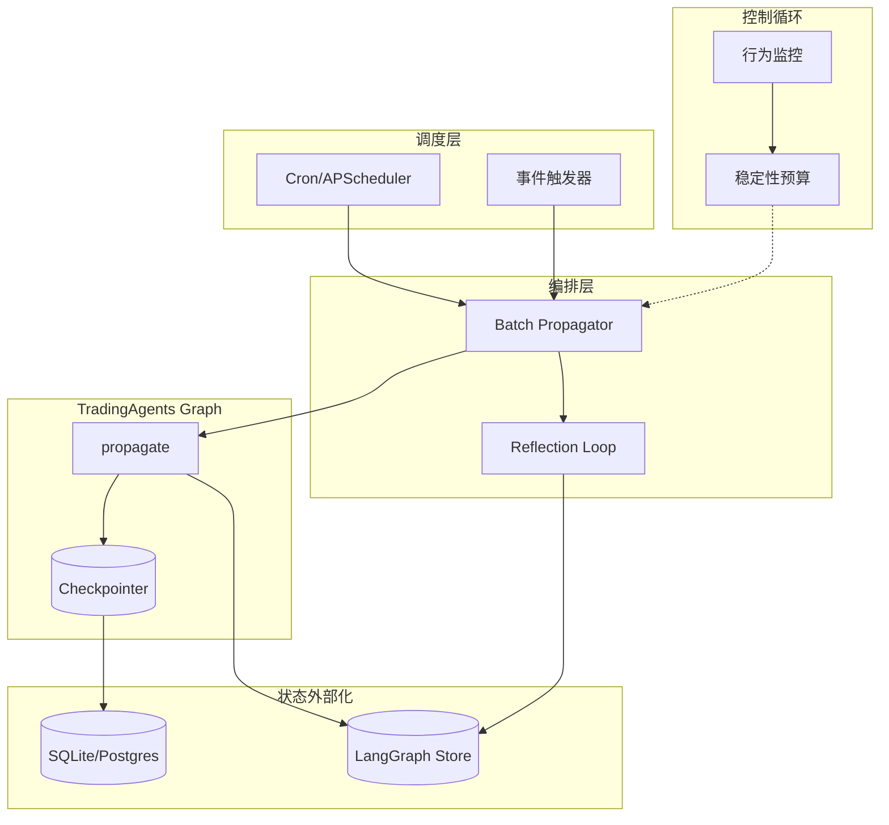
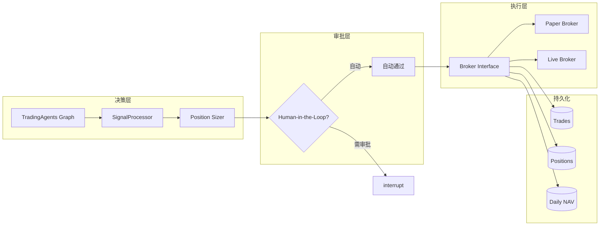

# TradingAgents 设计不足与升级改进方向

> 深度调研报告：当前项目设计缺陷、后续升级方向、Long-Run Agent 升级路径、自主交易 Agent 升级路径

---

## 1. 当前设计不足

### 1.1 执行层缺口

| 维度 | 现状 | 问题 |
| :--- | :--- | :--- |
| **订单执行** | 仅生成 BUY/SELL/HOLD 信号，无下单逻辑 | README 声称 "order sent to simulated exchange" 与实现不符 |
| **仓位/数量** | SignalProcessor 仅提取方向，无 quantity/position_size | 无法支持分批建仓、动态仓位管理 |
| **record_trade / upsert_position** | DatabaseManager 已实现，但未被调用 | 决策与交易记录脱节，无法追踪真实执行 |
| **经纪商抽象** | 无 Broker/Exchange 接口 | 无法接入实盘或模拟盘 |

### 1.2 运行模式缺口

| 维度 | 现状 | 问题 |
| :--- | :--- | :--- |
| **触发方式** | 仅支持单次 `propagate(ticker, date)` 调用 | 无定时、批量、事件驱动 |
| **调度器** | 无 | 无法实现每日收盘后自动分析、盘前预研 |
| **Reflection 闭环** | `reflect_and_remember()` 存在但未接入主流程 | 无法从历史收益/亏损中学习 |
| **Long-run 能力** | 无 | 无法 7×24 持续运行、跨日状态保持 |

### 1.3 信号与决策粒度

| 维度 | 现状 | 问题 |
| :--- | :--- | :--- |
| **Signal 输出** | 仅 BUY/SELL/HOLD | 无置信度、目标价、止损/止盈 |
| **仓位比例** | 仅在 Backtest 中通过 `allocation` 硬编码 | 无法由 Agent 动态决定 |
| **多标的组合** | 单 ticker 单 date 设计 | 无组合优化、相关性考量 |

### 1.4 数据与上下文

| 维度 | 现状 | 问题 |
| :--- | :--- | :--- |
| **Longport** | 仅用于行情/ K 线，无交易 API | 无法与 Longport 交易端打通 |
| **实时性** | 数据以 trade_date 为基准，非实时 | 盘中决策依赖收盘数据 |
| **Context 管理** | 单次 run 内无显式截断 | 长周期运行易触发 context 膨胀 |

---

## 2. 后续升级改进方向

### 2.1 短期（P0）

| 改进项 | 描述 | 实现要点 |
| :--- | :--- | :--- |
| **Broker 抽象层** | 定义 `BrokerInterface`，支持 paper/live 两种模式 | 参考 ib_insync、Hummingbot、AutoTrader 的 Order 抽象 |
| **决策 → 执行桥接** | 在 `_persist_decision` 后，若 signal=BUY/SELL，调用 `record_trade` + `upsert_position` | 需先实现 PaperBroker 模拟执行 |
| **Signal 扩展** | 从 `final_trade_decision` 中提取 confidence、quantity_ratio | 修改 `SignalProcessor` 与 prompt |

### 2.2 中期（P1）

| 改进项 | 描述 | 实现要点 |
| :--- | :--- | :--- |
| **调度器** | 引入 APScheduler 或 cron，支持每日/每周定时 run | 新增 `tradingagents scheduler` CLI |
| **批量 propagate** | 支持 `propagate_batch(tickers, date)` 或 watchlist | 复用现有 graph，并行/串行可选 |
| **Reflection 闭环** | 在每日/每周任务结束后，拉取收益数据，调用 `reflect_and_remember` | 需定义 returns_losses 数据源（DB/API） |

### 2.3 长期（P2）

| 改进项 | 描述 | 实现要点 |
| :--- | :--- | :--- |
| **组合优化** | 多标的权重分配、风险预算 | 引入 Portfolio 模块，与 Risk Judge 联动 |
| **实时行情驱动** | 盘中事件触发（如突破、异常波动） | 需 Longport/WebSocket 事件订阅 |
| **Trading-R1 集成** | 接入 TauricResearch Trading-R1 模型与 Terminal | 关注 [Trading-R1](https://github.com/TauricResearch/Trading-R1) 发布 |

---

## 3. Long-Run Agent 升级路径

### 3.1 概念定义

**Long-Run Agent**：能够持续运行、跨日/跨周保持状态、支持中断恢复、具备学习闭环的 Agent 系统。

### 3.2 业界方案参考

| 方案 | 核心思路 | 适用场景 |
| :--- | :--- | :--- |
| **InfiAgent** | 外部化持久状态，固定 context 窗口 | 无限时域任务 |
| **KLong** | 轨迹分割 + 渐进式 RL，长时程 SFT | 超长 horizon 决策 |
| **AICL** | 控制循环：规划 → 探测 → 事件编排 → 稳定性预算 | 行为漂移抑制 |
| **LangGraph interrupt()** | 节点内 `interrupt()` 暂停，checkpointer 持久化，`Command(resume=...)` 恢复 | Human-in-the-loop、审批流程 |

### 3.3 升级架构

系统架构图见 `assets/arch/05-long-run-agent-architecture.d2`。

### 3.4 实现要点

| 模块 | 职责 | 技术选型 |
| :--- | :--- | :--- |
| **调度器** | 定时触发、事件触发 | APScheduler（推荐）或 systemd/cron |
| **状态外部化** | 避免 context 膨胀 | 已有 Checkpointer + Store，需确保 `thread_id` 跨 run 复用 |
| **Reflection 闭环** | 收益反馈 → 记忆更新 | 在调度任务末尾调用 `reflect_and_remember(returns_losses)` |
| **Human-in-the-loop** | 关键决策前人工审批 | LangGraph `interrupt()` + `Command(resume=...)` |
| **稳定性监控** | 检测行为漂移 | 记录决策分布、胜率、回撤，设定阈值告警 |

### 3.5 新增配置项建议

| 配置键 | 类型 | 说明 |
| :--- | :--- | :--- |
| `scheduler_enabled` | bool | 是否启用调度 |
| `scheduler_cron` | str | 每日分析时间，如 `0 18 * * 1-5`（工作日 18:00） |
| `watchlist` | list[str] | 默认监控标的 |
| `reflection_after_run` | bool | 每次 run 后是否执行 reflection |
| `returns_data_source` | str | `database` / `broker_api` / `manual` |

---

## 4. 自主交易 Agent 升级路径

### 4.1 概念定义

**自主交易 Agent**：在满足风控与审批约束下，能够自动将 BUY/SELL 信号转化为真实订单并提交至经纪商的 Agent 系统。

### 4.2 架构设计

系统架构图见 `assets/arch/06-autonomous-trading-agent-architecture.d2`。

### 4.3 Broker 抽象接口（建议）

| 方法 | 签名 | 说明 |
| :--- | :--- | :--- |
| `place_order` | `(ticker, action, quantity, order_type, **kwargs) -> Order` | 下单 |
| `cancel_order` | `(order_id) -> bool` | 撤单 |
| `get_positions` | `() -> list[Position]` | 当前持仓 |
| `get_cash` | `() -> float` | 可用资金 |
| `get_order_status` | `(order_id) -> str` | 订单状态 |

### 4.4 开源经纪商 API 选型

| 库/框架 | 适用场景 | 备注 |
| :--- | :--- | :--- |
| **ib_insync** | Interactive Brokers | 成熟、异步支持 |
| **Hummingbot API** | 多交易所 | REST + MQTT，需部署 Hummingbot |
| **longport** | 港美 A 股 | 当前仅 QuoteContext，需确认是否有 TradeContext |
| **ccxt** | 加密货币 | 若扩展至 crypto |

### 4.5 实现阶段

| 阶段 | 内容 | 产出 |
| :--- | :--- | :--- |
| **Phase 1** | PaperBroker：内存模拟，记录至 `record_trade` / `upsert_position` | 无实盘风险，验证流程 |
| **Phase 2** | 扩展 Signal：输出 `(action, quantity_ratio, confidence)` | 支持动态仓位 |
| **Phase 3** | 接入 LangGraph `interrupt()`：Trader → Risk Judge 后、执行前暂停 | 人工确认后 resume |
| **Phase 4** | LiveBroker：接入 ib_insync 或 Longport Trade API | 实盘能力 |

### 4.6 风控前置条件

| 条件 | 说明 |
| :--- | :--- |
| **单笔上限** | 单笔订单金额 ≤ 账户 N% |
| **日交易限额** | 每日下单次数/金额上限 |
| **标的白名单** | 仅允许交易 watchlist 内标的 |
| **熔断** | 连续亏损或回撤超阈值时暂停交易 |

---

## 5. 总结

| 升级方向 | 核心动作 | 优先级 |
| :--- | :--- | :--- |
| **设计不足修复** | Broker 抽象、决策→执行桥接、Signal 扩展 | P0 |
| **Long-Run Agent** | 调度器、Reflection 闭环、状态外部化、interrupt 审批 | P1 |
| **自主交易 Agent** | PaperBroker → interrupt HITL → LiveBroker | P1→P2 |

当前项目已具备：多 Agent 协作、记忆、回测、数据库、Checkpointing。升级重点在于**补齐执行层**、**引入调度与闭环**、**接入经纪商**，并可选地通过 LangGraph `interrupt()` 实现人工审批，在自动化与风控之间取得平衡。
