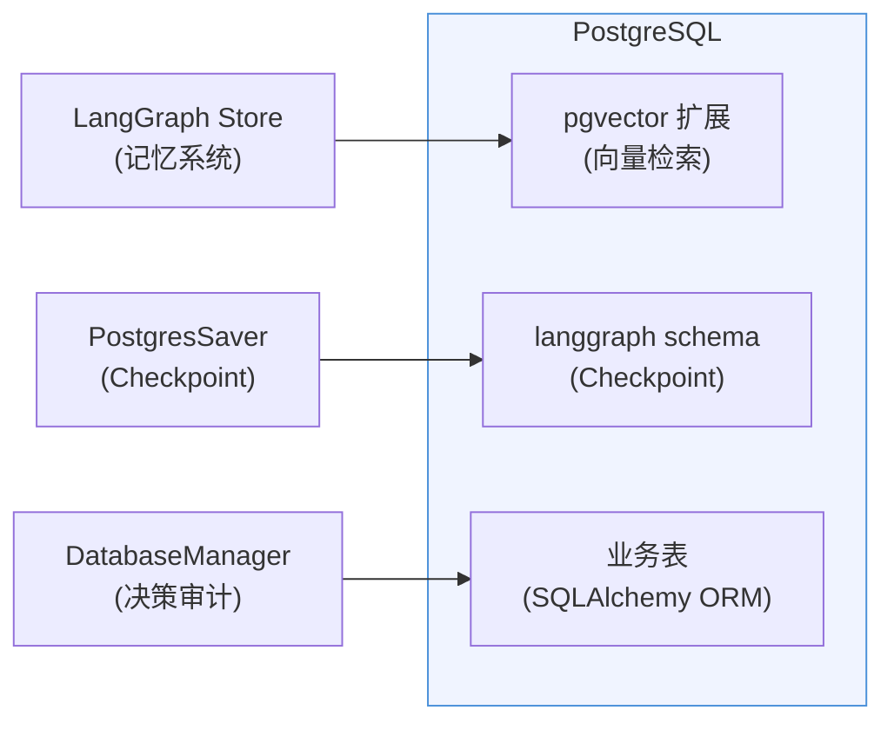

# 开源替代方案深度分析

> 基于项目定位（开源魔改、无需向后兼容），对 TradingAgents 各模块进行开源替代可行性评估。

---

## 总览：替换优先级矩阵

| 排名 | 模块 | 当前方案 | 推荐替代 | 收益 | 难度 | 优先级 |
|:---|:---|:---|:---|:---|:---|:---|
| **1** | 记忆系统 | BM25 (rank-bm25) | LangGraph Store + Embedding | 语义检索精度 ↑ 50%+ | 低 | **P0** |
| **2** | 数据库/持久化 | 裸 sqlite3 | SQLAlchemy + Alembic | 迁移自动化、类型安全 | 低-中 | **P1** |
| **3** | 技术指标 | stockstats | pandas-ta | 指标覆盖 ↑ 3x、维护活跃 | 低 | **P1** |
| **4** | Checkpoint | MemorySaver (内存) | langgraph-checkpoint-postgres | 持久化、断点恢复 | 低 | **P1** |
| **5** | 配置管理 | 裸 dict | Pydantic Settings v2 | 类型校验、env var 原生支持 | 低 | **P2** |
| **6** | Prompt 管理 | Langfuse + Fallback | 保持现状 + Jinja2 模板 | 已是开源最佳实践 | — | **保持** |
| **7** | 图编排引擎 | LangGraph 1.0 | 保持现状 | 已是业界最佳选择 | — | **保持** |
| **8** | 可观测性 | Langfuse | 保持现状 | 开源 + 自托管 | — | **保持** |

---

## 1. 记忆系统 — BM25 → LangGraph Store (P0 最高优先)

### 1.1 现状分析

| 维度 | 详情 |
|:---|:---|
| 代码位置 | `tradingagents/agents/utils/memory.py` (145 行) |
| 技术方案 | BM25Okapi 词袋模型 (`rank-bm25` 0.2.2) |
| 存储范围 | 每个 Agent 独立 `FinancialSituationMemory` 实例 |
| 持久化 | **无** — 纯内存，会话结束即丢失 |
| 检索方式 | 分词 → BM25 评分 → top-k |

### 1.2 核心问题

| 问题 | 严重度 | 说明 |
|:---|:---|:---|
| 仅关键词匹配 | **高** | "高通胀"与"CPI上升"被视为完全不同，语义理解为零 |
| 会话级易失 | **高** | 跨运行无法累积学习经验，每次冷启动 |
| 无向量化 | **高** | 缺少 Embedding，检索精度估计 < 50% |
| 规模受限 | **中** | 内存存储，数百条后性能下降 |

### 1.3 替代方案对比

| 方案 | 语义检索 | 持久化 | LangGraph 集成度 | 额外基础设施 | 推荐度 |
|:---|:---|:---|:---|:---|:---|
| **LangGraph Store** (原生) | ✓ 内置 semantic search | ✓ InMemoryStore / PostgresStore | **原生集成** | 无 (或 pgvector) | **★★★★★** |
| Mem0 | ✓ 多级记忆 (User/Session/Agent) | ✓ 多后端 | 有社区集成方案 | Mem0 服务 | ★★★★ |
| ChromaDB | ✓ 向量存储 | ✓ SQLite/持久化 | 需手动桥接 | 无 | ★★★ |
| Milvus / Qdrant | ✓ 生产级向量 DB | ✓ 分布式 | 需手动桥接 | 独立服务 | ★★ |

### 1.4 推荐方案：LangGraph Store + Embedding

**核心理由**：LangGraph 已原生支持 `BaseStore` 语义检索，**零额外依赖**，直接与现有图编排深度集成。

```python
# 当前 (BM25 词袋)
from rank_bm25 import BM25Okapi
scores = self.bm25.get_scores(query_tokens)  # 关键词匹配

# 替代 (LangGraph Store 语义检索)
from langgraph.store.memory import InMemoryStore  # 或 PostgresStore

store = InMemoryStore(
    index={"embed": embeddings, "dims": 1536, "fields": ["situation"]}
)
results = store.search(
    namespace=("memory", agent_name),
    query=current_situation,  # 语义匹配
    limit=3
)
```

LangGraph Store 支持两种后端：

| 后端 | 适用场景 | 语义检索 | 持久化 |
|:---|:---|:---|:---|
| `InMemoryStore` | 开发/测试 | ✓ (配置 index) | ✗ |
| `PostgresStore` (pgvector) | 生产环境 | ✓ (原生) | ✓ |

### 1.5 实施要点

1. 替换 `FinancialSituationMemory` 类，改用 `store.put()` / `store.search()`
2. Agent 节点签名添加 `store: BaseStore` 注入 (LangGraph 原生支持)
3. Embedding 模型复用 OpenAI `text-embedding-3-small` 或本地 `all-MiniLM-L6-v2`
4. 生产环境切换 `PostgresStore` + pgvector 实现跨会话持久化

---

## 2. 数据库/持久化层 — 裸 sqlite3 → SQLAlchemy + Alembic (P1)

### 2.1 现状分析

| 维度 | 详情 |
|:---|:---|
| 代码位置 | `tradingagents/database/manager.py` (291 行) + `schema.py` (158 行) |
| 技术方案 | Python 内置 `sqlite3`，无 ORM，原始 SQL 字符串 |
| Schema | 12 张表 (Portfolio 3 + Decision 2 + Raw Data 6 + Index 5) |
| 迁移方式 | 硬编码 `ALTER TABLE` in `_migrate_schema()` |

### 2.2 核心问题

| 问题 | 严重度 | 说明 |
|:---|:---|:---|
| 手工迁移 | **中** | 每新增字段需手动写 ALTER TABLE，易遗漏 |
| 无 ORM | **中** | 原始 SQL 拼接，维护性差 |
| 并发限制 | **中** | SQLite 单写锁，多 Agent 并行分析受阻 |
| JSON 列膨胀 | **中** | `market_report` 等字段存全文 JSON，无结构化查询能力 |

### 2.3 替代方案对比

| 方案 | 自动迁移 | 类型安全 | 并发支持 | JSON 查询 | 部署复杂度 |
|:---|:---|:---|:---|:---|:---|
| **SQLAlchemy + Alembic** (保留 SQLite) | ✓ Alembic | ✓ ORM Model | SQLite WAL | 有限 | **最低** |
| **SQLAlchemy + PostgreSQL** | ✓ Alembic | ✓ ORM Model | **优秀** | ✓ JSONB | 中 (需 PG) |
| **DuckDB** | ✗ | ✓ | **仅读并发** | ✓ | 低 |
| Tortoise-ORM / SQLModel | ✓ (自带) | ✓ | 取决于 DB | 取决于 DB | 低 |

### 2.4 推荐方案：分步走

**阶段 1**：保留 SQLite，引入 SQLAlchemy ORM + Alembic 迁移（最低成本，立即获益）

**阶段 2**（可选）：切换后端到 PostgreSQL，与 LangGraph `PostgresStore` / `PostgresSaver` 共享同一数据库实例，消除多数据库运维

| 步骤 | 改动范围 | 收益 |
|:---|:---|:---|
| 将 `schema.py` 转为 SQLAlchemy Model | `database/models.py` (新建) | 类型安全、自动生成迁移 |
| 引入 Alembic | `alembic/` 目录 | 版本化迁移，告别手工 ALTER |
| `manager.py` 改用 Session API | `database/manager.py` | 事务管理更安全 |

---

## 3. 技术指标 — stockstats → pandas-ta (P1)

### 3.1 现状分析

| 维度 | 详情 |
|:---|:---|
| 使用位置 | `tradingagents/dataflows/` 技术指标计算 |
| 当前依赖 | `stockstats>=0.6.5` |
| 指标覆盖 | ~30 个常见指标 (MACD, RSI, BB, KDJ 等) |

### 3.2 对比

| 维度 | stockstats | pandas-ta | TA-Lib (C 绑定) |
|:---|:---|:---|:---|
| 指标数量 | ~30 | **130+** | **150+** |
| 维护状态 | 低频更新 | **活跃** (月更) | 稳定但更新慢 |
| 安装难度 | pip install | pip install | **需编译 C 库** |
| API 风格 | 列名隐式计算 | 显式函数调用 | 函数调用 |
| 性能 | 中 | 中 | **高** (C 实现) |
| 自定义指标 | 困难 | **支持** | 需写 C |

### 3.3 推荐方案：pandas-ta

**理由**：指标覆盖全面 (130+)、纯 Python 无编译依赖、API 友好、项目已在 `[project.optional-dependencies]` 中预留了 `indicators = ["ta>=0.11.0"]`。

```python
# 当前 (stockstats)
from stockstats import StockDataFrame
sdf = StockDataFrame.retype(df)
macd = sdf['macd']  # 隐式列名触发计算

# 替代 (pandas-ta)
import pandas_ta as ta
df.ta.macd(append=True)  # 显式、可控
df.ta.strategy("all")    # 批量计算 130+ 指标
```

---

## 4. Checkpoint 持久化 — MemorySaver → PostgresSaver (P1)

### 4.1 现状分析

| 维度 | 详情 |
|:---|:---|
| 当前方案 | `MemorySaver()` (纯内存) 或 `SqliteSaver` (本地文件) |
| 位置 | `tradingagents/graph/trading_graph.py` |
| 问题 | 内存 Checkpoint 断电即失、SqliteSaver 无并发支持 |

### 4.2 推荐方案：langgraph-checkpoint-postgres

LangGraph 官方提供 `langgraph-checkpoint-postgres` 包（v3.0+），支持：

| 特性 | 说明 |
|:---|:---|
| 连接池 | 基于 psycopg_pool，支持生产级并发 |
| 异步支持 | `AsyncPostgresSaver` |
| 自动 Schema | 首次连接自动建表 |
| 断点恢复 | 跨进程、跨机器恢复图执行状态 |

```python
# 当前
from langgraph.checkpoint.memory import MemorySaver
checkpointer = MemorySaver()

# 替代
from langgraph.checkpoint.postgres import PostgresSaver
checkpointer = PostgresSaver.from_conn_string("postgresql://...")
```

**协同收益**：与数据库层 PostgreSQL 迁移共用同一 PG 实例，同时为 LangGraph Store (pgvector) 提供基础设施。

---

## 5. 配置管理 — 裸 dict → Pydantic Settings v2 (P2)

### 5.1 现状分析

| 维度 | 详情 |
|:---|:---|
| 方案 | 纯 Python dict (`DEFAULT_CONFIG`，45 个配置项) |
| 位置 | `tradingagents/default_config.py` (96 行) |
| 问题 | 无类型校验、无必填项检查、无环境分离 |

### 5.2 推荐方案：Pydantic Settings v2

项目已依赖 `pydantic>=2.12.5`，直接引入 `pydantic-settings` 即可：

```python
# 当前
DEFAULT_CONFIG = {
    "llm_provider": "openai",
    "deep_think_llm": "gpt-5.2",
    "valuation_enabled": True,
    ...
}

# 替代
from pydantic_settings import BaseSettings

class TradingConfig(BaseSettings):
    llm_provider: str = "openai"
    deep_think_llm: str = "gpt-5.2"
    valuation_enabled: bool = True
    langfuse_public_key: str | None = None  # 自动读 env var

    model_config = SettingsConfigDict(env_prefix="TA_")
```

| 收益 | 说明 |
|:---|:---|
| 类型安全 | 启动时即校验类型，非法值立即报错 |
| env var 原生 | 自动映射 `TA_LLM_PROVIDER` → `llm_provider` |
| `.env` 文件 | 配合 `python-dotenv` (已在依赖) 自动加载 |
| IDE 补全 | 属性访问替代 `dict.get()`，全程有提示 |

---

## 6-8. 无需替换的模块

### 6. Prompt 管理 — Langfuse ✓ 保持

| 评估 | 说明 |
|:---|:---|
| 当前方案 | Langfuse 远程 + 本地 Fallback 模板，三层缓存策略 |
| 结论 | **已是开源最佳实践**，无需替换 |
| 可选增强 | Fallback 模板迁移到 Jinja2 (支持条件逻辑) |

### 7. 图编排引擎 — LangGraph 1.0 ✓ 保持

| 评估 | 说明 |
|:---|:---|
| 当前方案 | LangGraph StateGraph + 条件边 + Checkpointer |
| 结论 | **业界 Agent 编排标准**，无成熟替代品 |
| 可选增强 | 多 Analyst 节点并行化 (LangGraph `Send` API) |

### 8. 可观测性 — Langfuse ✓ 保持

| 评估 | 说明 |
|:---|:---|
| 当前方案 | Langfuse CallbackHandler 自动追踪 |
| 结论 | **开源 LLM Observability 标杆**，无需替换 |
| 可选增强 | 启用 Langfuse Experiments 做 Prompt A/B 测试 |

---

## 基础设施收敛：PostgreSQL 统一化

以上 P0/P1 替换中，有三个模块可共享同一 PostgreSQL 实例：



| 共享资源 | 收益 |
|:---|:---|
| 单一 PG 实例 | 运维成本最低，一个 `docker-compose.yml` 搞定 |
| 连接池 | psycopg_pool 共享，避免连接爆炸 |
| 备份统一 | pg_dump 一次备份所有数据 |
| 事务一致性 | 决策记录 + Checkpoint + 记忆可在同一事务内 |

---

## 实施路线

### 阶段 1：记忆系统升级 + 技术指标切换

| 步骤 | 改动文件 | 说明 |
|:---|:---|:---|
| 1 | `agents/utils/memory.py` | 替换 BM25 → LangGraph InMemoryStore |
| 2 | `graph/setup.py` | 注入 `store` 到图编译 |
| 3 | Expert/Researcher 节点 | 签名添加 `store` 参数 |
| 4 | `dataflows/` 指标模块 | stockstats → pandas-ta |
| 5 | `pyproject.toml` | 移除 `rank-bm25`，`pandas-ta` 进主依赖 |

### 阶段 2：PostgreSQL 统一化

| 步骤 | 改动文件 | 说明 |
|:---|:---|:---|
| 1 | 新建 `database/models.py` | SQLAlchemy ORM Model |
| 2 | 引入 `alembic/` | 自动迁移框架 |
| 3 | `database/manager.py` | Session API 替代裸 SQL |
| 4 | `graph/trading_graph.py` | Checkpoint → PostgresSaver |
| 5 | 记忆系统 | InMemoryStore → PostgresStore (pgvector) |
| 6 | `docker-compose.yml` | PG + pgvector 容器化 |

### 阶段 3：配置增强 + 可选优化

| 步骤 | 改动文件 | 说明 |
|:---|:---|:---|
| 1 | `default_config.py` | dict → Pydantic Settings |
| 2 | Prompt Fallback | 迁移到 Jinja2 模板 (可选) |
| 3 | Graph 并行化 | Analyst 节点使用 `Send` 并行 (可选) |
