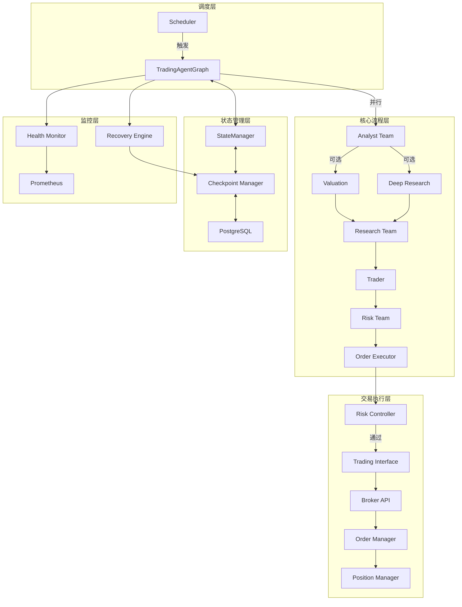

# TradingAgents 架构重构与升级综合设计Spec

## 文档说明

本文档综合了以下三个深度分析报告的所有内容：
- 设计不足与升级改进方向（`07-design-improvements-and-upgrade-roadmap.md`）
- 冗余代码与模块去留分析（`08-redundant-code-removal-analysis.md`）
- 架构与Agent设计Review（`09-architecture-and-agent-design-review.md`）

**设计原则**：
- 开源优先：优先使用成熟开源方案
- 设计先行：注重架构设计，减少代码实现细节
- 魔改项目：可做破坏性调整，无需向后兼容

## 1. 当前架构问题总览

### 1.1 问题分类与优先级

| 问题类别 | 问题数量 | P0数量 | P1数量 | P2数量 | 总体严重程度 |
|:--------|:--------|:------|:------|:------|:------------|
| **状态管理与持久化** | 5 | 2 | 2 | 1 | 高 |
| **交易执行能力** | 4 | 4 | 0 | 0 | 高 |
| **长期运行能力** | 4 | 2 | 2 | 0 | 高 |
| **架构设计问题** | 4 | 0 | 2 | 2 | 中 |
| **模块设计问题** | 4 | 2 | 2 | 0 | 高 |
| **Agent设计问题** | 4 | 3 | 1 | 0 | 高 |
| **流程设计问题** | 4 | 2 | 1 | 1 | 高 |
| **数据流问题** | 3 | 0 | 2 | 1 | 中 |
| **冗余代码模块** | 4 | 4 | 0 | 0 | 中 |
| **总计** | 36 | 19 | 12 | 5 | - |

### 1.2 关键问题矩阵

| 问题 | 类别 | 优先级 | 影响范围 | 修复难度 |
|:----|:----|:------|:--------|:--------|
| 无交易执行接口 | 功能缺失 | P0 | 核心功能 | 中 |
| 无长期运行能力 | 功能缺失 | P0 | 核心功能 | 中 |
| Agent职责不单一 | 架构设计 | P0 | 所有Agent | 高 |
| 代码重复严重 | 代码质量 | P0 | Bull/Bear/Risk | 中 |
| 状态管理分散 | 架构设计 | P0 | 全局 | 高 |
| 流程过于复杂 | 架构设计 | P0 | 流程构建 | 中 |
| Checkpoint内存存储 | 持久化 | P0 | 状态恢复 | 低 |
| 状态竞争风险 | 并发安全 | P0 | Bull/Bear | 中 |
| 模块职责不清晰 | 架构设计 | P0 | GraphSetup | 中 |
| 硬编码依赖 | 可扩展性 | P0 | Agent注册 | 中 |

## 2. 架构重构设计Spec

### 2.1 核心架构设计

#### 2.1.1 目标架构

#### 2.1.2 模块职责划分

| 模块层级 | 模块 | 职责 | 设计原则 |
|:--------|:----|:----|:--------|
| **调度层** | Scheduler | 定时任务调度、市场时间感知 | 单一职责 |
| **核心流程层** | GraphBuilder | 流程构建、节点注册 | 建造者模式 |
| **核心流程层** | NodeFactory | Agent节点创建 | 工厂模式 |
| **核心流程层** | EdgeConnector | 边连接、条件路由 | 策略模式 |
| **状态管理层** | StateManager | 状态生命周期管理 | 统一管理 |
| **状态管理层** | CheckpointManager | 状态持久化与恢复 | 持久化抽象 |
| **交易执行层** | TradingInterface | 交易接口抽象 | 适配器模式 |
| **交易执行层** | RiskController | 风险控制 | 规则引擎 |
| **交易执行层** | OrderManager | 订单管理 | 状态机 |
| **交易执行层** | PositionManager | 持仓管理 | 实时同步 |
| **监控层** | HealthMonitor | 健康检查 | 观察者模式 |
| **监控层** | RecoveryEngine | 错误恢复 | 重试机制 |

### 2.2 Agent架构重构

#### 2.2.1 Agent基类设计

| 组件 | 职责 | 设计要点 |
|:----|:----|:--------|
| **BaseAgent** | Agent基类 | 定义统一接口、横切关注点 |
| **BaseAnalyst** | Analyst基类 | 提取Analyst公共逻辑 |
| **BaseResearcher** | Researcher基类 | 提取Researcher公共逻辑 |
| **BaseDebator** | Debator基类 | 提取Debator公共逻辑 |
| **AgentRegistry** | Agent注册表 | 支持动态注册新Agent |

#### 2.2.2 Agent职责分离

| 当前问题 | 重构方案 | 设计要点 |
|:--------|:--------|:--------|
| Agent同时做分析和状态更新 | 分离为：Agent（分析）+ StateManager（状态更新） | 单一职责原则 |
| Agent直接访问状态字段 | 通过StateAccessor访问 | 状态访问抽象 |
| Agent代码重复严重 | 提取基类，参数化差异 | 模板方法模式 |

#### 2.2.3 Agent交互优化

| 问题 | 重构方案 | 设计要点 |
|:----|:--------|:--------|
| 循环依赖风险 | 引入状态机，明确转换规则 | 状态机模式 |
| 状态竞争 | 使用不可变状态或状态锁 | 并发安全 |
| 交互逻辑分散 | 统一条件逻辑框架 | 规则引擎 |

### 2.3 流程架构重构

#### 2.3.1 流程构建器设计

| 组件 | 职责 | 设计要点 |
|:----|:----|:--------|
| **WorkflowBuilder** | 流程构建器 | 使用Builder模式，简化流程构建 |
| **StageRegistry** | 阶段注册表 | 支持动态注册流程阶段 |
| **ConditionEvaluator** | 条件评估器 | 统一条件逻辑处理 |
| **RouteResolver** | 路由解析器 | 统一路由决策 |

#### 2.3.2 配置驱动流程

| 配置项 | 说明 | 设计要点 |
|:------|:----|:--------|
| **workflow.stages** | 流程阶段定义 | YAML配置，支持并行、顺序、可选 |
| **workflow.conditions** | 条件规则定义 | 规则引擎，支持组合条件 |
| **workflow.routing** | 路由规则定义 | 策略模式，可插拔路由逻辑 |

#### 2.3.3 可选节点管理

| 组件 | 职责 | 设计要点 |
|:----|:----|:--------|
| **OptionalNodeManager** | 可选节点管理器 | 统一管理可选节点的创建、注册、连接 |
| **NodeRegistry** | 节点注册表 | 维护节点元数据，自动处理可选节点 |
| **WorkflowValidator** | 流程验证器 | 验证流程完整性、无循环、可达性 |

### 2.4 状态管理架构

#### 2.4.1 状态管理器设计

| 组件 | 职责 | 设计要点 |
|:----|:----|:--------|
| **StateManager** | 状态管理器 | 统一状态生命周期管理 |
| **StateAccessor** | 状态访问器 | 统一状态访问接口，支持缓存 |
| **StateValidator** | 状态验证器 | 验证状态结构、转换合法性 |
| **StateCompressor** | 状态压缩器 | 压缩状态，消除冗余 |

#### 2.4.2 状态结构优化

| 当前问题 | 重构方案 | 设计要点 |
|:--------|:--------|:--------|
| 状态字段冗余 | 只保留必要字段，其他计算获得 | 计算属性 |
| 状态更新不一致 | 统一状态更新接口 | 状态更新事务 |
| 状态竞争 | 不可变状态或状态锁 | 并发安全 |
| 状态过大 | 状态压缩、分离存储 | 性能优化 |

### 2.5 数据流架构

#### 2.5.1 数据访问层设计

| 组件 | 职责 | 设计要点 |
|:----|:----|:--------|
| **DataAccessor** | 数据访问器 | 统一数据访问接口 |
| **DataCache** | 数据缓存 | 缓存重复读取的数据 |
| **DataPreloader** | 数据预加载器 | 流程开始前预加载数据 |

#### 2.5.2 数据流优化

| 优化项 | 设计要点 | 收益 |
|:------|:--------|:-----|
| **统一数据访问** | 通过DataAccessor访问，避免直接访问state | 解耦、易维护 |
| **数据缓存** | 缓存重复读取的数据和计算结果 | 性能提升 |
| **数据预加载** | 流程开始前预加载所有需要的数据 | 一致性、性能 |

## 3. 功能升级设计Spec

### 3.1 Long-Run Agent设计

#### 3.1.1 架构组件

| 组件 | 职责 | 开源工具 | 设计要点 |
|:----|:----|:--------|:--------|
| **Scheduler** | 定时任务调度 | APScheduler（单机）或Celery（分布式） | 市场时间感知、任务依赖 |
| **CheckpointManager** | 状态持久化 | LangGraph PostgresSaver | PostgreSQL后端、自动恢复 |
| **RecoveryEngine** | 错误恢复 | 自定义 | 从checkpoint恢复、重试机制 |
| **HealthMonitor** | 健康检查 | Prometheus + Grafana | 心跳机制、异常检测 |
| **PositionManager** | 持仓管理 | 自定义 | 实时同步、盈亏计算 |

#### 3.1.2 调度任务设计

| 任务类型 | 触发时机 | 任务内容 | 优先级 |
|:--------|:--------|:--------|:------|
| **分析任务** | 市场开盘前 | 运行完整分析流程 | 中 |
| **交易任务** | 分析完成后 | 执行交易决策 | 高 |
| **风控任务** | 定期（如每5分钟） | 持仓检查、风险计算 | 最高 |
| **复盘任务** | 收盘后 | 复盘分析、性能评估 | 低 |

#### 3.1.3 Checkpoint持久化设计

| 配置项 | 说明 | 默认值 | 设计要点 |
|:------|:----|:------|:--------|
| `checkpoint_storage` | 存储后端 | `postgres` | 支持memory/sqlite/postgres |
| `checkpoint_retention_days` | 保留天数 | `30` | 自动清理旧checkpoint |
| `checkpoint_auto_recover` | 自动恢复 | `True` | 异常后自动从checkpoint恢复 |
| `checkpoint_compression` | 状态压缩 | `True` | 压缩状态，减少存储空间 |

### 3.2 交易执行设计

#### 3.2.1 交易类型支持

| 交易类型 | 支持的操作 | 设计要点 |
|:--------|:----------|:--------|
| **股票交易** | Long、Sell、Short、Cover | 标准交易，支持做空 |
| **期权交易** | Buy Call/Put、Sell Call/Put | 基础期权交易 |
| **期权策略** | Covered Call、Straddle、Iron Condor等 | 组合订单，策略封装 |
| **组合订单** | Multi-leg、Spread、Strategy | 复杂订单支持 |

#### 3.2.2 交易接口设计

| 接口方法 | 功能 | 支持类型 | 设计要点 |
|:--------|:----|:--------|:--------|
| `place_order()` | 下单 | 股票、期权、组合 | 统一订单模型 |
| `place_strategy_order()` | 策略订单 | 期权策略 | 策略封装 |
| `get_position()` | 获取持仓 | 股票、期权、组合 | 统一持仓模型 |
| `cancel_order()` | 撤单 | 全部 | 订单状态管理 |
| `get_margin_requirement()` | 保证金要求 | Short、期权Sell | 风控支持 |

#### 3.2.3 适配器设计

| 适配器 | 支持功能 | 开源工具 | 优先级 |
|:------|:--------|:--------|:------|
| **Alpaca** | 股票、期权（基础）、做空 | Alpaca SDK | P0 |
| **Interactive Brokers** | 股票、期权（全面）、全球市场 | ib_async | P1 |

### 3.3 风险控制设计

#### 3.3.1 风控规则架构

| 组件 | 职责 | 开源工具 | 设计要点 |
|:----|:----|:--------|:--------|
| **RiskController** | 主风控控制器 | 自定义 | 统一入口，路由到具体规则 |
| **StockRiskRules** | 股票风控规则 | skfolio | Long/Short分别处理 |
| **OptionRiskRules** | 期权风控规则 | QuantLib | 希腊字母、保证金、时间价值 |
| **StrategyRiskRules** | 策略风控规则 | skfolio | 组合保证金、最大损失 |
| **RiskCalculator** | 风险计算器 | skfolio、pyfolio | VaR、CVaR等风险指标 |

#### 3.3.2 风控规则矩阵

| 交易类型 | 仓位限制 | 资金管理 | 止损止盈 | 特殊规则 | 优先级 |
|:--------|:--------|:--------|:--------|:--------|:------|
| **股票Long** | ✅ | ✅ | ✅ | - | P0 |
| **股票Short** | ✅ | ✅ | ✅ | 保证金、借券成本 | P0 |
| **期权Buy** | ✅ | ✅ | - | 权利金限制、时间价值 | P0 |
| **期权Sell** | ✅ | ✅ | - | 保证金、希腊字母、无限损失 | P0 |
| **组合策略** | ✅ | ✅ | - | 组合保证金、最大损失、盈亏平衡点 | P0 |

### 3.4 监控与告警设计

| 组件 | 职责 | 开源工具 | 设计要点 |
|:----|:----|:--------|:--------|
| **HealthMonitor** | 健康检查 | Prometheus | 数据库、LLM API、交易接口 |
| **MetricsCollector** | 指标收集 | Prometheus | 各节点执行时间、资源占用 |
| **AlertManager** | 告警管理 | Grafana | 邮件、Slack、Webhook |
| **PerformanceMonitor** | 性能监控 | Prometheus | 性能指标、瓶颈分析 |

## 4. 代码清理与重构Spec

### 4.1 立即删除的模块

| 模块/文件 | 删除原因 | 影响文件数 | 优先级 | 风险 |
|:---------|:--------|:----------|:------|:-----|
| `agents/specialists/` | 完全未使用 | 0 | P0 | 低 |
| `dataflows/utils.py` | 完全未使用 | 0 | P0 | 低 |
| `dataflows/alpha_vantage.py` | Facade，可直接导入 | 1 | P0 | 低 |
| `agents/utils/agent_utils.py` | Facade，可直接导入 | 7 | P0 | 中 |
| `config/settings.py` | 配置系统重复（需评估） | 需评估 | P1 | 中 |

### 4.2 模块重构设计

#### 4.2.1 GraphSetup拆分

| 当前职责 | 拆分后模块 | 设计要点 |
|:--------|:----------|:--------|
| 节点创建 | NodeFactory | 工厂模式，支持动态注册 |
| 图构建 | GraphBuilder | 建造者模式，简化构建 |
| 边连接 | EdgeConnector | 策略模式，可插拔路由 |

#### 4.2.2 ConditionalLogic拆分

| 当前职责 | 拆分后模块 | 设计要点 |
|:--------|:----------|:--------|
| 条件判断 | ConditionEvaluator | 统一条件评估框架 |
| 路由决策 | RouteResolver | 策略模式，可插拔路由 |
| 收敛检测 | ConvergenceDetector | 独立收敛检测逻辑 |

#### 4.2.3 Agent基类提取

| 重复代码 | 基类设计 | 参数化差异 |
|:--------|:--------|:----------|
| Bull/Bear Researcher（90%重复） | BaseResearcher | prompt_name、prefix |
| 三个Risk Debator（85%重复） | BaseDebator | prompt_name、prefix、style |
| 四个Analyst（70%重复） | BaseAnalyst | prompt_name、tools |

### 4.3 状态管理重构

#### 4.3.1 状态结构优化

| 当前问题 | 优化方案 | 设计要点 |
|:--------|:--------|:--------|
| `history`与`bull_history`/`bear_history`冗余 | 只保留`history`，其他计算获得 | 计算属性 |
| `history`与`current_*_response`冗余 | 只保留`history`，从`history`提取 | 按需提取 |
| 状态更新分散 | 统一StateManager更新 | 状态更新事务 |

#### 4.3.2 状态访问优化

| 优化项 | 设计要点 | 收益 |
|:------|:--------|:-----|
| **StateAccessor** | 统一状态访问接口 | 解耦、易维护 |
| **数据缓存** | 缓存重复读取的数据 | 性能提升 |
| **状态压缩** | 压缩状态，减少存储 | 性能、存储优化 |

## 5. 开源工具集成Spec

### 5.1 工具选型矩阵

| 功能 | 推荐工具 | 开源状态 | 优先级 | 实施难度 | 收益 |
|:----|:--------|:--------|:------|:--------|:-----|
| **调度** | APScheduler（单机）或Celery（分布式） | ✅ BSD | P0 | 低 | 高 |
| **交易接口** | Alpaca SDK | ✅ Apache 2.0 | P0 | 低 | 高 |
| **风险控制** | skfolio | ✅ BSD 3-Clause | P1 | 中 | 高 |
| **期权定价** | QuantLib | ✅ BSD | P1 | 中 | 中 |
| **风险分析** | pyfolio | ✅ Apache 2.0 | P1 | 中 | 中 |
| **监控** | Prometheus + Grafana | ✅ Apache 2.0 | P1 | 中 | 中 |
| **订单管理** | EOMS | ✅ PyPI | P2 | 高 | 中 |
| **回测** | backtrader | ✅ GPL 3.0 | P2 | 中 | 中 |

### 5.2 集成设计要点

| 工具 | 集成方式 | 设计要点 |
|:----|:--------|:--------|
| **APScheduler** | 作为Scheduler组件 | 市场时间感知、任务依赖管理 |
| **Alpaca SDK** | 作为TradingInterface实现 | 适配器模式，支持切换 |
| **skfolio** | 作为RiskCalculator | 风险度量和投资组合优化 |
| **QuantLib** | 作为OptionPricer | 期权定价和希腊字母计算 |
| **Prometheus** | 作为MetricsCollector | 指标收集和暴露 |

## 6. 实施路线图

### 6.1 Phase 1: 代码清理与基础重构（2-3周）

| 任务 | 优先级 | 预计时间 | 风险 |
|:----|:------|:--------|:-----|
| 删除未使用模块 | P0 | 1天 | 低 |
| 删除Facade文件 | P0 | 1天 | 低-中 |
| 引入Agent基类 | P0 | 3天 | 中 |
| 重构状态管理 | P0 | 4天 | 高 |
| 修复状态竞争 | P0 | 2天 | 中 |
| 拆分GraphSetup | P1 | 3天 | 中 |
| 简化条件逻辑 | P1 | 2天 | 中 |

### 6.2 Phase 2: Long-Run Agent实现（2-3周）

| 任务 | 优先级 | 预计时间 | 风险 |
|:----|:------|:--------|:-----|
| Checkpoint升级为PostgreSQL | P0 | 3天 | 低 |
| 实现状态恢复机制 | P0 | 2天 | 中 |
| 实现定时调度器（APScheduler） | P0 | 3天 | 低 |
| 实现健康检查 | P1 | 2天 | 低 |
| 集成Prometheus监控 | P1 | 2天 | 低 |

### 6.3 Phase 3: 交易执行实现（3-4周）

| 任务 | 优先级 | 预计时间 | 风险 |
|:----|:------|:--------|:-----|
| 设计TradingInterface抽象层 | P0 | 2天 | 低 |
| 实现Alpaca适配器 | P0 | 3天 | 中 |
| 实现RiskController（集成skfolio） | P0 | 4天 | 中 |
| 实现OrderExecutor节点 | P0 | 3天 | 中 |
| 集成到主流程 | P0 | 2天 | 中 |
| 实现OrderManager | P1 | 2天 | 低 |
| 实现PositionManager | P1 | 2天 | 低 |

### 6.4 Phase 4: 增强功能（2-3周）

| 任务 | 优先级 | 预计时间 | 风险 |
|:----|:------|:--------|:-----|
| 完善数据关联（Lineage统一） | P1 | 2天 | 低 |
| 实现错误恢复机制 | P1 | 3天 | 中 |
| 优化数据流（DataAccessor） | P1 | 2天 | 低 |
| 引入插件机制 | P2 | 4天 | 中 |
| 配置驱动流程 | P2 | 3天 | 中 |

## 7. 架构设计原则

### 7.1 设计模式应用

| 设计模式 | 应用场景 | 收益 |
|:--------|:--------|:-----|
| **工厂模式** | Agent创建 | 统一接口，支持动态注册 |
| **建造者模式** | 流程构建 | 简化复杂流程构建 |
| **策略模式** | 条件逻辑、路由决策 | 可插拔逻辑 |
| **适配器模式** | 交易接口、数据源 | 统一接口，支持切换 |
| **模板方法** | Agent基类 | 提取公共逻辑 |
| **观察者模式** | 状态更新、监控 | 解耦业务逻辑 |
| **状态机** | 订单管理、流程状态 | 明确状态转换规则 |

### 7.2 架构原则

| 原则 | 说明 | 应用 |
|:----|:----|:-----|
| **单一职责** | 每个模块只负责一个功能 | GraphSetup拆分、Agent职责分离 |
| **开闭原则** | 对扩展开放，对修改关闭 | Agent注册机制、插件系统 |
| **依赖倒置** | 依赖抽象而非具体实现 | TradingInterface抽象、Agent基类 |
| **接口隔离** | 使用多个专门接口 | 细粒度接口设计 |
| **最小知识** | 减少模块间依赖 | 状态访问抽象、配置注入 |

## 8. 配置设计Spec

### 8.1 配置结构设计

| 配置分类 | 配置项 | 说明 | 默认值 |
|:--------|:------|:----|:------|
| **核心配置** | `llm_provider` | LLM提供商 | `openai` |
| **核心配置** | `checkpoint_storage` | Checkpoint后端 | `postgres` |
| **核心配置** | `trading_enabled` | 是否启用交易 | `False` |
| **调度配置** | `scheduler_provider` | 调度框架 | `apscheduler` |
| **调度配置** | `market_open_time` | 市场开盘时间 | `09:30` |
| **交易配置** | `trading_provider` | 交易接口 | `alpaca` |
| **交易配置** | `allow_short` | 允许做空 | `False` |
| **交易配置** | `allow_options` | 允许期权 | `False` |
| **风控配置** | `max_position_size` | 单票最大仓位 | `0.1` |
| **风控配置** | `max_daily_loss` | 单日最大亏损 | `0.05` |

### 8.2 流程配置设计

| 配置项 | 说明 | 设计要点 |
|:------|:----|:--------|
| `workflow.stages` | 流程阶段定义 | YAML配置，支持并行、顺序、可选 |
| `workflow.conditions` | 条件规则定义 | 规则引擎配置 |
| `workflow.routing` | 路由规则定义 | 策略配置 |

## 9. 数据模型设计Spec

### 9.1 状态模型优化

| 当前状态 | 优化后状态 | 设计要点 |
|:--------|:----------|:--------|
| `InvestDebateState` | 只保留`history`和`count` | `bull_history`、`bear_history`改为计算属性 |
| `RiskDebateState` | 只保留`history`和`count` | `*_history`、`current_*_response`改为计算属性 |
| `AgentState` | 添加缓存字段 | `_cached_reports`、`_cached_situation` |

### 9.2 订单模型设计

| 字段 | 类型 | 说明 | 示例 |
|:----|:----|:----|:-----|
| `order_type` | Enum | 订单类型 | `STOCK_LONG`, `OPTION_BUY_CALL`, `STRATEGY_COVERED_CALL` |
| `symbol` | str | 标的代码 | `AAPL` |
| `action` | Enum | 操作 | `BUY`, `SELL`, `SHORT`, `COVER` |
| `quantity` | float | 数量 | `100` |
| `legs` | List[Leg] | 多腿订单 | `[{symbol, action, quantity}, ...]` |
| `strategy_type` | Enum | 策略类型 | `COVERED_CALL`, `STRADDLE` |
| `expiration` | date | 到期日（期权） | `2026-03-15` |
| `strike` | float | 行权价（期权） | `150.0` |

## 10. 接口设计Spec

### 10.1 Agent接口设计

| 接口方法 | 输入 | 输出 | 设计要点 |
|:--------|:----|:----|:--------|
| `analyze()` | AgentState | AgentOutput | Agent只负责分析 |
| `execute()` | AgentState | dict | 包含错误处理、日志、监控 |

### 10.2 状态管理接口

| 接口方法 | 功能 | 设计要点 |
|:--------|:----|:--------|
| `update_debate_state()` | 更新辩论状态 | 统一更新，自动保持同步 |
| `update_risk_state()` | 更新风险状态 | 统一更新，自动保持同步 |
| `get_state()` | 获取状态 | 通过StateAccessor，支持缓存 |
| `validate_state()` | 验证状态 | 验证状态结构和转换合法性 |

### 10.3 交易接口设计

| 接口方法 | 功能 | 支持类型 | 设计要点 |
|:--------|:----|:--------|:--------|
| `place_order()` | 下单 | 股票、期权、组合 | 统一订单模型 |
| `place_strategy_order()` | 策略订单 | 期权策略 | 策略封装 |
| `get_position()` | 获取持仓 | 全部 | 统一持仓模型 |
| `cancel_order()` | 撤单 | 全部 | 订单状态管理 |

## 11. 关键设计决策

### 11.1 架构决策

| 决策项 | 方案 | 理由 |
|:------|:----|:-----|
| **配置系统** | 统一使用字典配置（`defaults.py`） | 灵活性优先，魔改项目 |
| **Agent创建** | 引入Agent基类和注册机制 | 消除重复，支持扩展 |
| **状态管理** | 统一StateManager | 消除冗余，保证一致性 |
| **流程构建** | 配置驱动 + 构建器模式 | 简化构建，提高可扩展性 |
| **交易接口** | 抽象层 + 适配器模式 | 支持多券商，易于切换 |

### 11.2 技术选型决策

| 功能 | 选型 | 理由 |
|:----|:----|:-----|
| **调度** | APScheduler（单机） | 轻量级，无外部依赖 |
| **交易接口** | Alpaca SDK（优先） | API简单，支持纸面交易 |
| **风险控制** | skfolio | 功能全面，与scikit-learn兼容 |
| **监控** | Prometheus + Grafana | 生产环境标准 |
| **Checkpoint** | PostgreSQL | 支持长期运行，高可用 |

## 12. 实施检查清单

### 12.1 Phase 1检查清单

- [ ] 删除`agents/specialists/`目录
- [ ] 删除`dataflows/utils.py`
- [ ] 删除`dataflows/alpha_vantage.py`并修改导入
- [ ] 删除`agents/utils/agent_utils.py`并修改导入
- [ ] 引入Agent基类（BaseAgent、BaseAnalyst、BaseResearcher、BaseDebator）
- [ ] 重构状态管理（StateManager、StateAccessor）
- [ ] 修复状态竞争（不可变状态或状态锁）
- [ ] 拆分GraphSetup（NodeFactory、GraphBuilder、EdgeConnector）
- [ ] 简化条件逻辑（ConditionEvaluator、RouteResolver）

### 12.2 Phase 2检查清单

- [ ] Checkpoint升级为PostgreSQL
- [ ] 实现状态恢复机制（RecoveryEngine）
- [ ] 实现定时调度器（APScheduler集成）
- [ ] 实现健康检查（HealthMonitor）
- [ ] 集成Prometheus监控

### 12.3 Phase 3检查清单

- [ ] 设计TradingInterface抽象层
- [ ] 实现Alpaca适配器
- [ ] 实现RiskController（集成skfolio）
- [ ] 实现OrderExecutor节点
- [ ] 集成到主流程
- [ ] 实现OrderManager
- [ ] 实现PositionManager

### 12.4 Phase 4检查清单

- [ ] 统一Lineage集成（所有数据源）
- [ ] 实现错误恢复机制
- [ ] 优化数据流（DataAccessor、缓存）
- [ ] 引入插件机制（可选）
- [ ] 配置驱动流程（可选）

## 13. 风险与缓解

### 13.1 技术风险

| 风险 | 影响 | 缓解措施 |
|:----|:----|:--------|
| 状态管理重构影响面大 | 高 | 分阶段实施，充分测试 |
| Agent基类引入可能破坏现有功能 | 中 | 保持向后兼容过渡期 |
| 交易接口集成复杂度高 | 中 | 先实现Alpaca，充分测试 |
| 流程重构可能引入bug | 中 | 配置驱动，易于回滚 |

### 13.2 实施风险

| 风险 | 影响 | 缓解措施 |
|:----|:----|:--------|
| 重构时间超预期 | 中 | 分阶段实施，优先P0 |
| 测试不充分 | 高 | 每个阶段充分测试 |
| 文档不完善 | 低 | 重构前完善文档 |

## 14. 成功标准

### 14.1 架构质量指标

| 指标 | 目标 | 测量方式 |
|:----|:----|:--------|
| **代码重复率** | < 10% | 代码分析工具 |
| **模块耦合度** | 低 | 依赖分析 |
| **测试覆盖率** | > 80% | 测试工具 |
| **性能** | 分析时间 < 5分钟 | 性能测试 |

### 14.2 功能完整性

| 功能 | 完成标准 |
|:----|:--------|
| **Long-Run Agent** | 支持7x24小时运行，自动恢复 |
| **交易执行** | 支持股票、期权、策略交易 |
| **风险控制** | 实时风控，支持所有交易类型 |
| **监控告警** | 完善的监控和告警机制 |

## 15. 总结

### 15.1 核心改进方向

1. **架构重构**：模块职责清晰、降低耦合、提高可扩展性
2. **Agent重构**：引入基类、消除重复、职责分离
3. **状态管理**：统一管理、消除冗余、保证一致性
4. **流程优化**：配置驱动、简化构建、提高可维护性
5. **功能升级**：Long-Run Agent、交易执行、风险控制

### 15.2 实施优先级

**P0（必须实现）**：19项
- 代码清理（4项）
- Agent重构（3项）
- 状态管理重构（3项）
- Long-Run Agent基础（3项）
- 交易执行基础（4项）
- 架构重构基础（2项）

**P1（重要）**：12项
- 架构优化（4项）
- 功能增强（4项）
- 监控告警（2项）
- 数据流优化（2项）

**P2（可选）**：5项
- 插件机制
- 配置驱动流程
- 性能优化
- 状态版本管理
- 配置热更新

### 15.3 预期收益

1. **代码质量**：代码重复率从70-90%降至<10%
2. **架构清晰度**：模块职责清晰，耦合度降低
3. **可扩展性**：支持动态注册Agent，插件机制
4. **可维护性**：统一接口，易于测试和维护
5. **功能完整性**：支持长期运行和交易执行
