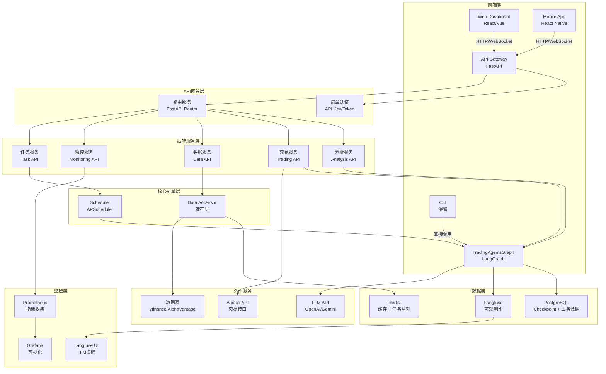
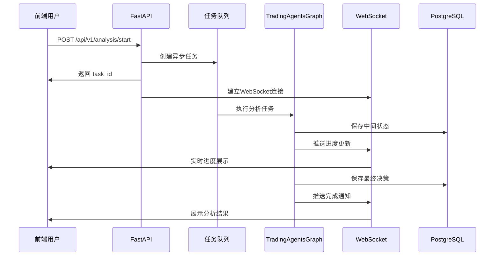
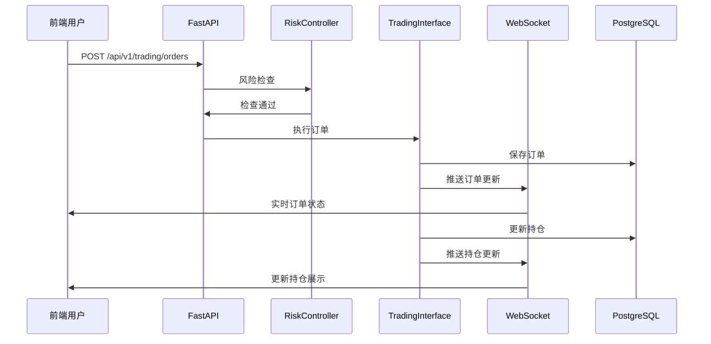
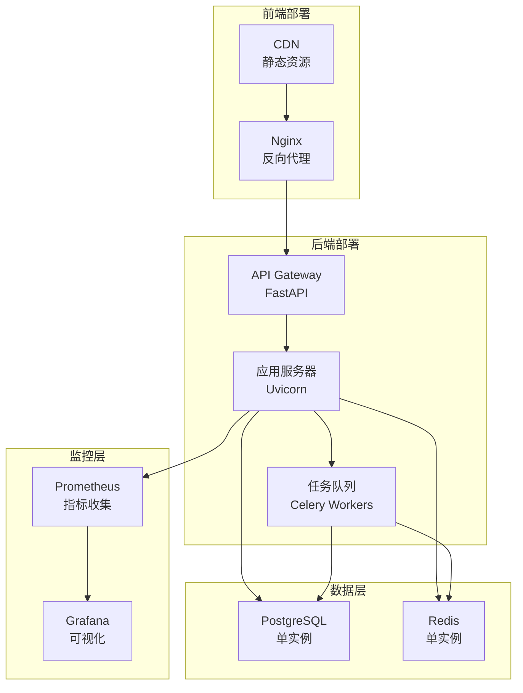

# TradingAgents 前后端分离改造深度评估

## 文档说明

本文档深度评估如何将当前TradingAgents项目改造为前后端分离架构，明确前后端职责划分、技术选型、实施路线图。

**设计原则**：
- 开源优先：优先使用成熟开源方案
- 设计先行：注重架构设计，减少代码实现细节
- 魔改项目：可做破坏性调整，无需向后兼容

## 1. 当前架构分析

### 1.1 现有架构概览

| 组件类型 | 当前实现 | 技术栈 | 状态 |
|:--------|:--------|:------|:-----|
| **CLI界面** | `tradingagents/cli/main.py` | Typer + Rich | ✅ 完整 |
| **Dashboard** | `dashboard/app.py` | Streamlit | ✅ 完整 |
| **后端核心** | `tradingagents/graph/` | LangGraph + Python | ✅ 完整 |
| **数据库层** | `tradingagents/database/` | SQLAlchemy | ✅ 完整 |
| **交易接口** | `tradingagents/trading/` | 抽象层 + Alpaca | ✅ 完整 |
| **API层** | 未实现 | FastAPI（依赖已存在） | ❌ 缺失 |

### 1.2 当前用户交互方式

| 交互方式 | 使用场景 | 限制 |
|:--------|:--------|:-----|
| **CLI交互** | 单次分析、交互式配置 | 需要本地环境，无法远程访问 |
| **Streamlit Dashboard** | 查看历史决策、NAV曲线 | 单用户，状态管理简单，性能受限 |
| **Python API** | 程序化调用 | 需要Python环境，无REST接口 |

### 1.3 改造需求分析

| 需求类别 | 具体需求 | 优先级 |
|:--------|:--------|:------|
| **远程访问** | Web界面、API接口、远程调用 | P0 |
| **实时交互** | WebSocket推送、实时状态更新 | P0 |
| **移动端支持** | 响应式设计、移动端适配 | P1 |
| **性能优化** | 异步处理、任务队列、缓存 | P0 |
| **可维护性** | 前后端分离、代码组织 | P0 |
| **监控告警** | 系统监控、性能分析 | P1 |

**注意**：本项目为单用户使用场景，无需多用户认证、权限管理、多租户等复杂功能。

## 2. 前后端分离架构设计

### 2.1 整体架构图



### 2.2 前后端职责划分

#### 2.2.1 前端职责

| 功能模块 | 具体职责 | 技术实现 |
|:--------|:--------|:--------|
| **用户界面** | 页面渲染、交互响应、路由管理 | React/Vue + React Router/Vue Router |
| **状态管理** | 前端状态、缓存、本地存储 | Redux/Zustand/Pinia |
| **实时通信** | WebSocket连接、消息推送 | Socket.io-client/原生WebSocket |
| **数据可视化** | 图表展示、决策分析、NAV曲线 | Chart.js/ECharts/Plotly.js |
| **表单处理** | 配置表单、参数输入、验证 | React Hook Form/VeeValidate |
| **文件管理** | 报告下载、数据导出 | File API/Blob API |
| **响应式设计** | 移动端适配、多设备支持 | Tailwind CSS/响应式布局 |

#### 2.2.2 后端职责

| 功能模块 | 具体职责 | 技术实现 |
|:--------|:--------|:--------|
| **API服务** | RESTful API、GraphQL（可选） | FastAPI + Pydantic |
| **简单认证** | API Key/Token验证 | 简单中间件 |
| **业务逻辑** | 分析流程、交易执行、决策生成 | TradingAgentsGraph |
| **任务调度** | 定时任务、异步任务、任务队列 | APScheduler + Celery（可选） |
| **数据管理** | 数据库操作、缓存管理、数据访问 | SQLAlchemy + Redis |
| **实时推送** | WebSocket服务、事件推送 | FastAPI WebSocket/Server-Sent Events |
| **文件处理** | 报告生成、数据导入导出 | Python文件处理 |
| **监控告警** | 指标收集、日志管理、告警 | Prometheus + Grafana |

### 2.3 技术栈选型

#### 2.3.1 前端技术栈

| 技术类别 | 推荐方案 | 备选方案 | 理由 |
|:--------|:--------|:--------|:-----|
| **框架** | React 18+ | Vue 3 | 生态成熟，组件丰富 |
| **构建工具** | Vite | Webpack | 开发体验好，构建速度快 |
| **UI框架** | Ant Design / Material-UI | Tailwind CSS | 组件完整，开箱即用 |
| **状态管理** | Zustand / Redux Toolkit | Pinia | 轻量级，易用 |
| **路由** | React Router v6 | Vue Router | 标准方案 |
| **HTTP客户端** | Axios / Fetch API | - | 简单易用 |
| **WebSocket** | Socket.io-client | 原生WebSocket | 自动重连，功能完善 |
| **图表库** | ECharts / Recharts | Chart.js | 功能强大，性能好 |
| **表单处理** | React Hook Form | Formik | 性能好，易用 |
| **类型检查** | TypeScript | - | 类型安全 |

#### 2.3.2 后端技术栈

| 技术类别 | 推荐方案 | 备选方案 | 理由 |
|:--------|:--------|:--------|:-----|
| **Web框架** | FastAPI | Flask/Django | 性能好，自动文档，类型提示 |
| **异步框架** | Uvicorn | Gunicorn | ASGI标准，支持异步 |
| **简单认证** | 自定义中间件 | - | 单用户场景，简单API Key验证（可选） |
| **数据库ORM** | SQLAlchemy 2.0 | Tortoise ORM | 成熟稳定，功能强大 |
| **缓存** | Redis | Memcached | 功能丰富，支持多种数据结构 |
| **任务队列** | Celery + Redis | RQ | 功能强大，支持分布式 |
| **WebSocket** | FastAPI WebSocket | Socket.io | 原生支持，性能好 |
| **API文档** | OpenAPI/Swagger | - | FastAPI自动生成 |
| **日志** | structlog | logging | 结构化日志，易分析 |
| **监控** | Prometheus + Grafana | - | 标准方案 |

## 3. API设计规范

### 3.1 API端点设计

#### 3.1.1 分析服务API

| 端点 | 方法 | 功能 | 请求参数 | 响应 |
|:----|:----|:----|:--------|:----|
| `/api/v1/analysis/start` | POST | 启动分析任务 | `ticker`, `date`, `analysts[]`, `config` | `task_id`, `status` |
| `/api/v1/analysis/{task_id}` | GET | 获取分析状态 | - | `status`, `progress`, `result` |
| `/api/v1/analysis/{task_id}/stream` | WebSocket | 实时流式更新 | - | `chunk` (SSE/WebSocket) |
| `/api/v1/analysis/{task_id}/cancel` | POST | 取消分析任务 | - | `status` |
| `/api/v1/analysis/history` | GET | 获取历史分析 | `ticker?`, `start_date?`, `end_date?`, `limit?` | `decisions[]` |
| `/api/v1/analysis/{decision_id}` | GET | 获取决策详情 | - | `decision`, `reports`, `data_links` |

#### 3.1.2 交易服务API

| 端点 | 方法 | 功能 | 请求参数 | 响应 |
|:----|:----|:----|:--------|:----|
| `/api/v1/trading/positions` | GET | 获取持仓列表 | - | `positions[]` |
| `/api/v1/trading/positions/{ticker}` | GET | 获取单个持仓 | - | `position` |
| `/api/v1/trading/orders` | GET | 获取订单列表 | `status?`, `ticker?` | `orders[]` |
| `/api/v1/trading/orders` | POST | 创建订单 | `order` | `order_id`, `status` |
| `/api/v1/trading/orders/{order_id}` | GET | 获取订单详情 | - | `order` |
| `/api/v1/trading/orders/{order_id}/cancel` | POST | 取消订单 | - | `status` |
| `/api/v1/trading/portfolio` | GET | 获取投资组合 | - | `portfolio`, `nav`, `returns` |

#### 3.1.3 数据服务API

| 端点 | 方法 | 功能 | 请求参数 | 响应 |
|:----|:----|:----|:--------|:----|
| `/api/v1/data/market/{ticker}` | GET | 获取市场数据 | `period?`, `interval?` | `price_data`, `indicators` |
| `/api/v1/data/fundamentals/{ticker}` | GET | 获取基本面数据 | - | `fundamentals` |
| `/api/v1/data/news/{ticker}` | GET | 获取新闻数据 | `limit?` | `news[]` |
| `/api/v1/data/nav` | GET | 获取NAV数据 | `start_date?`, `end_date?` | `nav_records[]` |
| `/api/v1/data/backtest` | POST | 运行回测 | `ticker`, `start_date`, `end_date`, `config` | `metrics`, `trades[]` |

#### 3.1.4 任务服务API

| 端点 | 方法 | 功能 | 请求参数 | 响应 |
|:----|:----|:----|:--------|:----|
| `/api/v1/tasks` | GET | 获取任务列表 | `status?`, `type?` | `tasks[]` |
| `/api/v1/tasks/{task_id}` | GET | 获取任务详情 | - | `task` |
| `/api/v1/tasks/{task_id}/cancel` | POST | 取消任务 | - | `status` |
| `/api/v1/tasks/schedule` | POST | 创建定时任务 | `schedule`, `config` | `task_id` |
| `/api/v1/tasks/schedule/{task_id}` | DELETE | 删除定时任务 | - | `status` |

#### 3.1.5 监控服务API

| 端点 | 方法 | 功能 | 请求参数 | 响应 |
|:----|:----|:----|:--------|:----|
| `/api/v1/monitoring/health` | GET | 健康检查 | - | `status`, `components` |
| `/api/v1/monitoring/metrics` | GET | 获取指标 | `metric?`, `time_range?` | `metrics[]` |
| `/api/v1/monitoring/logs` | GET | 获取日志 | `level?`, `limit?` | `logs[]` |

### 3.2 WebSocket事件设计

| 事件类型 | 事件名称 | 数据格式 | 说明 |
|:--------|:--------|:--------|:----|
| **分析进度** | `analysis:progress` | `{task_id, progress, status, chunk}` | 分析任务进度更新 |
| **分析完成** | `analysis:complete` | `{task_id, result}` | 分析任务完成 |
| **分析错误** | `analysis:error` | `{task_id, error}` | 分析任务错误 |
| **订单更新** | `trading:order:update` | `{order_id, status, data}` | 订单状态更新 |
| **持仓更新** | `trading:position:update` | `{ticker, position}` | 持仓变化 |
| **系统通知** | `system:notification` | `{type, message, data}` | 系统通知 |

### 3.3 数据模型设计

#### 3.3.1 请求/响应模型

```python
# 分析任务请求
class AnalysisRequest(BaseModel):
    ticker: str
    date: str  # YYYY-MM-DD
    analysts: List[str] = ["market", "social", "news", "fundamentals"]
    config: Optional[Dict[str, Any]] = None

# 分析任务响应
class AnalysisResponse(BaseModel):
    task_id: str
    status: str  # pending, running, completed, failed
    created_at: datetime

# 分析结果
class DecisionResult(BaseModel):
    decision_id: int
    ticker: str
    trade_date: str
    final_decision: str
    confidence: Optional[float]
    reports: Dict[str, str]
    created_at: datetime
```

## 4. 前后端功能实现清单

### 4.1 前端功能清单

#### 4.1.1 核心功能

| 功能模块 | 子功能 | 优先级 | 说明 |
|:--------|:------|:------|:-----|
| **简单认证** | API Key验证 | P1 | 简单的API Key验证（可选） |
| **分析管理** | 创建分析任务 | P0 | 表单配置，参数选择 |
| **分析管理** | 实时进度展示 | P0 | WebSocket流式更新 |
| **分析管理** | 历史决策查看 | P0 | 列表、筛选、搜索 |
| **分析管理** | 决策详情展示 | P0 | 完整报告、数据溯源 |
| **交易管理** | 持仓查看 | P0 | 实时持仓、盈亏 |
| **交易管理** | 订单管理 | P0 | 订单列表、状态跟踪 |
| **交易管理** | 投资组合 | P0 | NAV曲线、收益分析 |
| **数据可视化** | 图表展示 | P0 | 价格、指标、NAV曲线 |
| **数据可视化** | 决策分布 | P1 | 饼图、柱状图 |
| **任务调度** | 定时任务管理 | P1 | 创建、编辑、删除 |
| **系统监控** | 健康状态 | P1 | 系统组件状态 |
| **系统监控** | 性能指标 | P1 | 响应时间、资源使用 |

#### 4.1.2 增强功能

| 功能模块 | 子功能 | 优先级 | 说明 |
|:--------|:------|:------|:-----|
| **报告管理** | 报告导出 | P1 | PDF、Excel、Markdown |
| **报告管理** | 报告分享 | P2 | 链接分享 |
| **配置管理** | 系统配置 | P1 | LLM选择、参数配置 |
| **通知中心** | 消息通知 | P1 | 任务完成、错误告警 |
| **通知中心** | 邮件通知 | P2 | 邮件推送 |
| **移动端** | 响应式设计 | P1 | 移动端适配 |
| **移动端** | PWA支持 | P2 | 离线访问 |

### 4.2 后端功能清单

#### 4.2.1 核心功能

| 功能模块 | 子功能 | 优先级 | 说明 |
|:--------|:------|:------|:-----|
| **API服务** | RESTful API | P0 | 完整API端点 |
| **API服务** | WebSocket服务 | P0 | 实时推送 |
| **API服务** | API文档 | P0 | OpenAPI/Swagger |
| **简单认证** | API Key验证 | P1 | 简单的API Key验证（可选，单用户场景可省略） |
| **分析服务** | 任务创建 | P0 | 异步任务处理 |
| **分析服务** | 状态管理 | P0 | 任务状态跟踪 |
| **分析服务** | 流式输出 | P0 | WebSocket/SSE推送 |
| **交易服务** | 订单管理 | P0 | 订单CRUD |
| **交易服务** | 持仓管理 | P0 | 持仓同步 |
| **交易服务** | 风险控制 | P0 | 实时风控检查 |
| **数据服务** | 数据查询 | P0 | 市场数据、基本面 |
| **数据服务** | 缓存管理 | P0 | Redis缓存 |
| **任务调度** | 定时任务 | P0 | APScheduler集成 |
| **任务调度** | 任务队列 | P1 | Celery集成 |
| **监控服务** | 健康检查 | P0 | 组件健康状态 |
| **监控服务** | 指标收集 | P0 | Prometheus集成 |
| **监控服务** | 日志管理 | P0 | 结构化日志 |

#### 4.2.2 增强功能

| 功能模块 | 子功能 | 优先级 | 说明 |
|:--------|:------|:------|:-----|
| **文件服务** | 报告生成 | P1 | PDF、Excel生成 |
| **文件服务** | 文件存储 | P1 | 对象存储集成 |
| **通知服务** | 消息推送 | P1 | WebSocket推送 |
| **通知服务** | 邮件服务 | P2 | SMTP集成 |
| **数据分析** | 统计分析 | P1 | 决策统计、性能分析 |
| **数据分析** | 回测服务 | P1 | 回测引擎集成 |

## 5. 实施路线图

### 5.1 Phase 1: 基础API层（2-3周）

| 任务 | 优先级 | 预计时间 | 依赖 |
|:----|:------|:--------|:-----|
| 设计API规范 | P0 | 2天 | - |
| 实现FastAPI基础框架 | P0 | 3天 | - |
| 实现简单认证（可选） | P1 | 1天 | FastAPI框架 |
| 实现分析服务API | P0 | 5天 | API框架 |
| 实现数据服务API | P0 | 3天 | API框架 |
| 实现WebSocket服务 | P0 | 3天 | API框架 |
| API文档生成 | P0 | 1天 | API完成 |
| 单元测试 | P0 | 3天 | API完成 |

### 5.2 Phase 2: 前端基础（2-3周）

| 任务 | 优先级 | 预计时间 | 依赖 |
|:----|:------|:--------|:-----|
| 搭建前端项目 | P0 | 2天 | - |
| 实现简单认证（可选） | P1 | 1天 | 后端API |
| 实现分析任务创建 | P0 | 5天 | 后端API |
| 实现实时进度展示 | P0 | 4天 | WebSocket |
| 实现历史决策查看 | P0 | 3天 | 后端API |
| 实现基础UI组件 | P0 | 3天 | UI框架 |
| 集成测试 | P0 | 2天 | 功能完成 |

### 5.3 Phase 3: 交易功能（2-3周）

| 任务 | 优先级 | 预计时间 | 依赖 |
|:----|:------|:--------|:-----|
| 实现交易服务API | P0 | 5天 | 后端框架 |
| 实现持仓管理API | P0 | 3天 | 交易服务 |
| 实现订单管理API | P0 | 3天 | 交易服务 |
| 实现前端交易界面 | P0 | 5天 | 交易API |
| 实现投资组合展示 | P0 | 3天 | 交易API |
| 集成测试 | P0 | 2天 | 功能完成 |

### 5.4 Phase 4: 数据可视化（1-2周）

| 任务 | 优先级 | 预计时间 | 依赖 |
|:----|:------|:--------|:-----|
| 实现图表组件 | P0 | 3天 | 图表库 |
| 实现NAV曲线 | P0 | 2天 | 图表组件 |
| 实现决策分布 | P1 | 2天 | 图表组件 |
| 实现数据可视化 | P1 | 3天 | 数据API |
| 性能优化 | P1 | 2天 | 功能完成 |

### 5.5 Phase 5: 增强功能（2-3周）

| 任务 | 优先级 | 预计时间 | 依赖 |
|:----|:------|:--------|:-----|
| 实现任务调度API | P1 | 3天 | 后端框架 |
| 实现定时任务管理 | P1 | 3天 | 调度API |
| 实现报告导出 | P1 | 3天 | 文件服务 |
| 实现通知中心 | P1 | 3天 | WebSocket |
| 实现移动端适配 | P1 | 4天 | 响应式设计 |
| 性能优化 | P1 | 3天 | 功能完成 |

## 6. 关键技术决策

### 6.1 架构决策

| 决策项 | 方案 | 理由 |
|:------|:----|:-----|
| **API风格** | RESTful + WebSocket | 标准、易理解、工具支持好 |
| **认证方式** | API Key（可选） | 单用户场景，简单验证即可 |
| **任务处理** | 异步 + 任务队列 | 支持长时间任务、可扩展 |
| **实时通信** | WebSocket | 双向通信、低延迟 |
| **数据缓存** | Redis | 高性能、支持多种数据结构 |
| **前端框架** | React | 生态成熟、组件丰富 |
| **状态管理** | Zustand | 轻量级、易用 |

### 6.2 技术选型决策

| 功能 | 选型 | 理由 |
|:----|:----|:-----|
| **后端框架** | FastAPI | 性能好、自动文档、类型提示 |
| **前端框架** | React | 生态成熟、社区活跃 |
| **UI组件库** | Ant Design | 组件完整、文档好 |
| **图表库** | ECharts | 功能强大、性能好 |
| **任务队列** | Celery | 功能强大、支持分布式 |
| **缓存** | Redis | 功能丰富、性能好 |
| **监控** | Prometheus + Grafana | 标准方案、功能完善 |

## 7. 数据流设计

### 7.1 分析任务流程



### 7.2 交易执行流程



## 8. 安全设计

### 8.1 安全措施

| 安全层面 | 措施 | 实现方式 | 说明 |
|:--------|:----|:--------|:-----|
| **简单认证** | API Key/Token | 简单中间件 | 单用户场景，可选实现 |
| **数据加密** | HTTPS | TLS/SSL | 生产环境必须 |
| **API安全** | Rate Limiting | SlowAPI | 防止滥用 |
| **输入验证** | Pydantic | 自动验证 | 必须实现 |
| **SQL注入** | ORM | SQLAlchemy | 必须实现 |
| **XSS防护** | 前端转义 | React自动转义 | 必须实现 |
| **CSRF防护** | Token验证 | CSRF Token | 可选实现 |

**注意**：单用户场景下，可以简化认证授权，使用简单的API Key验证即可，或完全省略认证（仅限本地访问）。

## 9. 性能优化

### 9.1 前端优化

| 优化项 | 方案 | 收益 |
|:------|:----|:-----|
| **代码分割** | React.lazy + Suspense | 减少初始加载 |
| **虚拟滚动** | react-window | 大列表性能 |
| **缓存策略** | React Query | 减少API调用 |
| **图片优化** | WebP、懒加载 | 减少带宽 |
| **打包优化** | Vite优化 | 减小包体积 |

### 9.2 后端优化

| 优化项 | 方案 | 收益 |
|:------|:----|:-----|
| **异步处理** | FastAPI异步 | 提高并发 |
| **数据库连接池** | SQLAlchemy Pool | 减少连接开销 |
| **缓存策略** | Redis缓存 | 减少数据库查询 |
| **任务队列** | Celery | 异步任务处理 |
| **CDN** | 静态资源CDN | 减少服务器负载 |

## 10. 部署方案

### 10.1 部署架构



### 10.2 部署方式

| 部署方式 | 适用场景 | 工具 |
|:--------|:--------|:-----|
| **本地开发** | 开发环境 | 直接运行 |
| **Docker Compose** | 单机部署 | Docker Compose |
| **云平台** | 远程访问 | VPS/云服务器 |

## 11. 测试策略

### 11.1 测试类型

| 测试类型 | 覆盖范围 | 工具 |
|:--------|:--------|:-----|
| **单元测试** | 后端逻辑 | pytest |
| **集成测试** | API端点 | pytest + httpx |
| **E2E测试** | 前端流程 | Playwright/Cypress |
| **性能测试** | 负载测试 | Locust/k6 |
| **安全测试** | 安全漏洞 | OWASP ZAP |

## 12. 总结

### 12.1 核心改进

1. **前后端分离**：清晰的职责划分，独立开发部署
2. **RESTful API**：标准接口，易于集成和远程访问
3. **实时通信**：WebSocket支持，实时更新
4. **远程访问**：Web界面，支持远程使用
5. **可维护性**：清晰的架构，易于维护和扩展

### 12.2 实施优先级

**P0（必须实现）**：
- API层基础框架
- 分析服务API
- 前端基础功能
- 实时通信（WebSocket）

**P1（重要）**：
- 简单认证（API Key，可选）
- 交易功能
- 数据可视化
- 任务调度
- 监控告警

**P2（可选）**：
- 移动端支持
- 高级分析
- 报告导出

### 12.3 预期收益

1. **用户体验**：Web界面，实时交互，支持远程访问
2. **可维护性**：前后端分离，清晰的架构，易于维护
3. **开发效率**：前后端独立开发，API接口标准化
4. **性能**：异步处理，缓存优化，提升响应速度
5. **安全性**：基础安全措施，适合单用户场景
