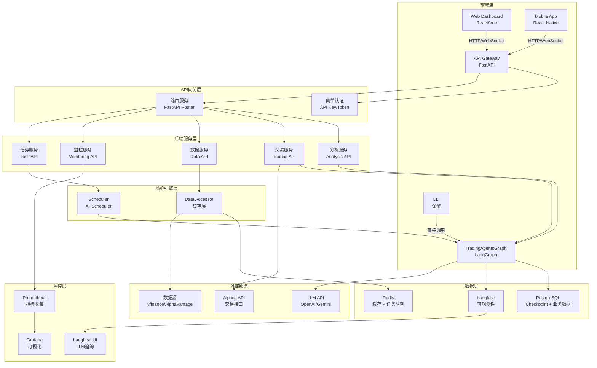
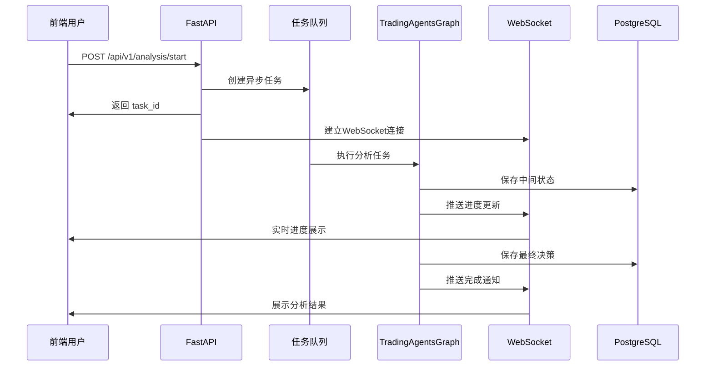
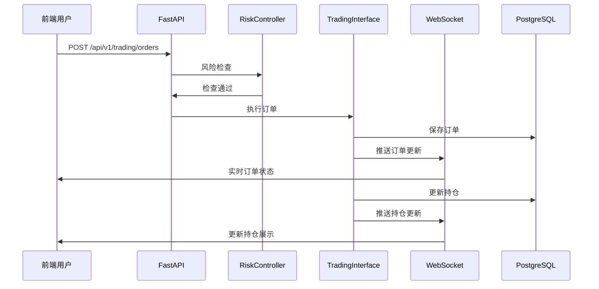
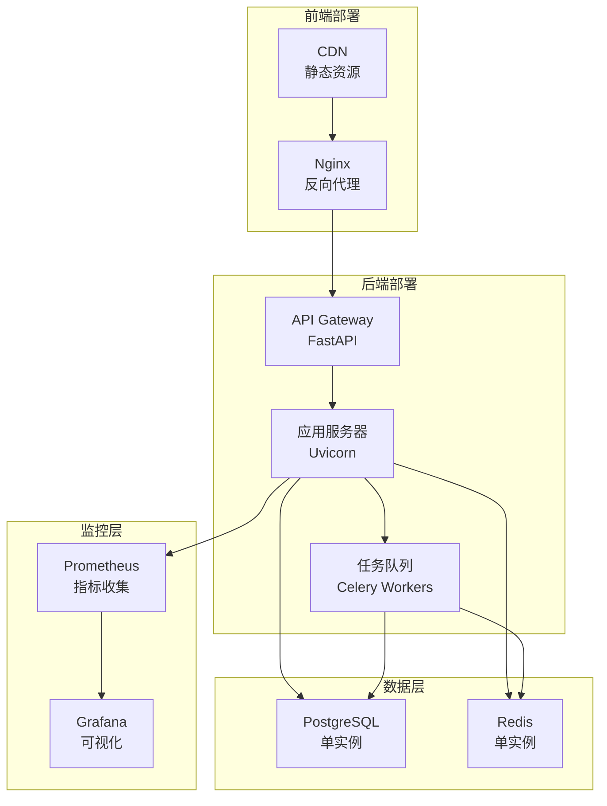

# TradingAgents 前后端分离改造深度评估

## 文档说明

本文档深度评估如何将当前TradingAgents项目改造为前后端分离架构，明确前后端职责划分、技术选型、实施路线图。

**设计原则**：
- 开源优先：优先使用成熟开源方案
- 设计先行：注重架构设计，减少代码实现细节
- 魔改项目：可做破坏性调整，无需向后兼容

## 1. 当前架构分析

### 1.1 现有架构概览

| 组件类型 | 当前实现 | 技术栈 | 状态 |
|:--------|:--------|:------|:-----|
| **CLI界面** | `tradingagents/cli/main.py` | Typer + Rich | ✅ 完整 |
| **Dashboard** | `dashboard/app.py` | Streamlit | ✅ 完整 |
| **后端核心** | `tradingagents/graph/` | LangGraph + Python | ✅ 完整 |
| **数据库层** | `tradingagents/database/` | SQLAlchemy | ✅ 完整 |
| **交易接口** | `tradingagents/trading/` | 抽象层 + Alpaca | ✅ 完整 |
| **API层** | 未实现 | FastAPI（依赖已存在） | ❌ 缺失 |

### 1.2 当前用户交互方式

| 交互方式 | 使用场景 | 限制 |
|:--------|:--------|:-----|
| **CLI交互** | 单次分析、交互式配置 | 需要本地环境，无法远程访问 |
| **Streamlit Dashboard** | 查看历史决策、NAV曲线 | 单用户，状态管理简单，性能受限 |
| **Python API** | 程序化调用 | 需要Python环境，无REST接口 |

### 1.3 改造需求分析

| 需求类别 | 具体需求 | 优先级 |
|:--------|:--------|:------|
| **远程访问** | Web界面、API接口、远程调用 | P0 |
| **实时交互** | WebSocket推送、实时状态更新 | P0 |
| **移动端支持** | 响应式设计、移动端适配 | P1 |
| **性能优化** | 异步处理、任务队列、缓存 | P0 |
| **可维护性** | 前后端分离、代码组织 | P0 |
| **监控告警** | 系统监控、性能分析 | P1 |

**注意**：本项目为单用户使用场景，无需多用户认证、权限管理、多租户等复杂功能。

## 2. 前后端分离架构设计

### 2.1 整体架构图



### 2.2 前后端职责划分

#### 2.2.1 前端职责

| 功能模块 | 具体职责 | 技术实现 |
|:--------|:--------|:--------|
| **用户界面** | 页面渲染、交互响应、路由管理 | React/Vue + React Router/Vue Router |
| **状态管理** | 前端状态、缓存、本地存储 | Redux/Zustand/Pinia |
| **实时通信** | WebSocket连接、消息推送 | Socket.io-client/原生WebSocket |
| **数据可视化** | 图表展示、决策分析、NAV曲线 | Chart.js/ECharts/Plotly.js |
| **表单处理** | 配置表单、参数输入、验证 | React Hook Form/VeeValidate |
| **文件管理** | 报告下载、数据导出 | File API/Blob API |
| **响应式设计** | 移动端适配、多设备支持 | Tailwind CSS/响应式布局 |

#### 2.2.2 后端职责

| 功能模块 | 具体职责 | 技术实现 |
|:--------|:--------|:--------|
| **API服务** | RESTful API、GraphQL（可选） | FastAPI + Pydantic |
| **简单认证** | API Key/Token验证 | 简单中间件 |
| **业务逻辑** | 分析流程、交易执行、决策生成 | TradingAgentsGraph |
| **任务调度** | 定时任务、异步任务、任务队列 | APScheduler + Celery（可选） |
| **数据管理** | 数据库操作、缓存管理、数据访问 | SQLAlchemy + Redis |
| **实时推送** | WebSocket服务、事件推送 | FastAPI WebSocket/Server-Sent Events |
| **文件处理** | 报告生成、数据导入导出 | Python文件处理 |
| **监控告警** | 指标收集、日志管理、告警 | Prometheus + Grafana |

### 2.3 技术栈选型

#### 2.3.1 前端技术栈

| 技术类别 | 推荐方案 | 备选方案 | 理由 |
|:--------|:--------|:--------|:-----|
| **框架** | React 18+ | Vue 3 | 生态成熟，组件丰富 |
| **构建工具** | Vite | Webpack | 开发体验好，构建速度快 |
| **UI框架** | Ant Design / Material-UI | Tailwind CSS | 组件完整，开箱即用 |
| **状态管理** | Zustand / Redux Toolkit | Pinia | 轻量级，易用 |
| **路由** | React Router v6 | Vue Router | 标准方案 |
| **HTTP客户端** | Axios / Fetch API | - | 简单易用 |
| **WebSocket** | Socket.io-client | 原生WebSocket | 自动重连，功能完善 |
| **图表库** | ECharts / Recharts | Chart.js | 功能强大，性能好 |
| **表单处理** | React Hook Form | Formik | 性能好，易用 |
| **类型检查** | TypeScript | - | 类型安全 |

#### 2.3.2 后端技术栈

| 技术类别 | 推荐方案 | 备选方案 | 理由 |
|:--------|:--------|:--------|:-----|
| **Web框架** | FastAPI | Flask/Django | 性能好，自动文档，类型提示 |
| **异步框架** | Uvicorn | Gunicorn | ASGI标准，支持异步 |
| **简单认证** | 自定义中间件 | - | 单用户场景，简单API Key验证（可选） |
| **数据库ORM** | SQLAlchemy 2.0 | Tortoise ORM | 成熟稳定，功能强大 |
| **缓存** | Redis | Memcached | 功能丰富，支持多种数据结构 |
| **任务队列** | Celery + Redis | RQ | 功能强大，支持分布式 |
| **WebSocket** | FastAPI WebSocket | Socket.io | 原生支持，性能好 |
| **API文档** | OpenAPI/Swagger | - | FastAPI自动生成 |
| **日志** | structlog | logging | 结构化日志，易分析 |
| **监控** | Prometheus + Grafana | - | 标准方案 |

## 3. API设计规范（简化版）

### 3.1 核心API端点

基于三个核心需求，API设计聚焦于：

#### 3.1.1 用户信息与持仓API

| 端点 | 方法 | 功能 | 请求参数 | 响应 |
|:----|:----|:----|:--------|:----|
| `/api/v1/portfolio` | GET | 获取投资组合概览 | - | `total_value`, `cash`, `positions_value`, `total_pnl`, `daily_return` |
| `/api/v1/positions` | GET | 获取持仓列表 | - | `positions[]` (包含ticker, quantity, avg_cost, current_price, pnl) |
| `/api/v1/nav` | GET | 获取NAV历史 | `start_date?`, `end_date?`, `limit?` | `nav_records[]` (用于绘制NAV曲线) |

#### 3.1.2 Agent决策输出API

| 端点 | 方法 | 功能 | 请求参数 | 响应 |
|:----|:----|:----|:--------|:----|
| `/api/v1/decisions` | GET | 获取决策列表 | `ticker?`, `start_date?`, `end_date?`, `limit?` | `decisions[]` (包含ticker, date, decision, confidence) |
| `/api/v1/decisions/{decision_id}` | GET | 获取决策详情 | - | `decision` (包含所有Agent输出：market_report, sentiment_report, news_report, fundamentals_report, investment_plan, trader_plan, final_decision) |

#### 3.1.3 信息流API

| 端点 | 方法 | 功能 | 请求参数 | 响应 |
|:----|:----|:----|:--------|:----|
| `/api/v1/datafeed` | GET | 获取实时数据流 | `limit?`, `type?` | `data_items[]` (包含type, ticker, data, timestamp) |
| `/api/v1/datafeed/stream` | WebSocket | 实时数据流推送 | - | 实时推送新数据 |

### 3.2 WebSocket事件设计（简化版）

| 事件类型 | 事件名称 | 数据格式 | 说明 |
|:--------|:--------|:--------|:----|
| **持仓更新** | `position:update` | `{ticker, position, pnl}` | 持仓变化、盈亏更新 |
| **投资组合更新** | `portfolio:update` | `{total_value, cash, positions_value, total_pnl}` | 投资组合总览更新 |
| **新决策** | `decision:new` | `{decision_id, ticker, date, decision}` | 新决策产生 |
| **数据流更新** | `datafeed:new` | `{type, ticker, data, timestamp}` | 新数据流推送 |

### 3.2 WebSocket事件设计

| 事件类型 | 事件名称 | 数据格式 | 说明 |
|:--------|:--------|:--------|:----|
| **分析进度** | `analysis:progress` | `{task_id, progress, status, chunk}` | 分析任务进度更新 |
| **分析完成** | `analysis:complete` | `{task_id, result}` | 分析任务完成 |
| **分析错误** | `analysis:error` | `{task_id, error}` | 分析任务错误 |
| **订单更新** | `trading:order:update` | `{order_id, status, data}` | 订单状态更新 |
| **持仓更新** | `trading:position:update` | `{ticker, position}` | 持仓变化 |
| **系统通知** | `system:notification` | `{type, message, data}` | 系统通知 |

### 3.3 数据模型设计

#### 3.3.1 请求/响应模型

```python
# 分析任务请求
class AnalysisRequest(BaseModel):
    ticker: str
    date: str  # YYYY-MM-DD
    analysts: List[str] = ["market", "social", "news", "fundamentals"]
    config: Optional[Dict[str, Any]] = None

# 分析任务响应
class AnalysisResponse(BaseModel):
    task_id: str
    status: str  # pending, running, completed, failed
    created_at: datetime

# 分析结果
class DecisionResult(BaseModel):
    decision_id: int
    ticker: str
    trade_date: str
    final_decision: str
    confidence: Optional[float]
    reports: Dict[str, str]
    created_at: datetime
```

## 4. 前后端功能实现清单

### 4.1 核心需求分析

基于单用户场景，核心需求聚焦于三个主要方面：

| 需求类别 | 具体内容 | 说明 |
|:--------|:--------|:-----|
| **用户信息展示** | 持仓、盈亏、投资组合 | 实时显示交易状态和收益 |
| **信息流展示** | 实时数据、市场数据、新闻 | 实时抓取的数据流展示 |
| **Agent决策输出** | 分析结果、决策历史、报告 | Agent的各个决策输出展示 |

### 4.2 前端功能清单（简化版）

#### 4.2.1 核心页面

| 页面/模块 | 功能 | 优先级 | 说明 |
|:--------|:----|:------|:-----|
| **仪表盘（Dashboard）** | 概览信息 | P0 | 持仓总览、盈亏、NAV曲线 |
| **持仓页面** | 持仓列表 | P0 | 实时持仓、盈亏、成本价 |
| **信息流页面** | 实时数据流 | P0 | 市场数据、新闻、指标更新 |
| **决策历史页面** | Agent决策列表 | P0 | 历史决策、筛选、搜索 |
| **决策详情页面** | 决策报告 | P0 | 完整分析报告、各Agent输出 |
| **实时监控** | WebSocket实时更新 | P0 | 持仓变化、新决策推送 |

#### 4.2.2 辅助功能

| 功能模块 | 子功能 | 优先级 | 说明 |
|:--------|:------|:------|:-----|
| **触发分析** | 创建分析任务 | P1 | 手动触发分析（可选） |
| **配置管理** | 系统配置 | P2 | LLM选择、参数配置（可选） |
| **数据导出** | 报告导出 | P2 | PDF、Excel导出（可选） |

### 4.3 后端功能清单（简化版）

#### 4.3.1 核心API

| 功能模块 | 子功能 | 优先级 | 说明 |
|:--------|:------|:------|:-----|
| **API服务** | RESTful API | P0 | 核心API端点 |
| **API服务** | WebSocket服务 | P0 | 实时推送（持仓、决策、数据流） |
| **持仓API** | 获取持仓列表 | P0 | 实时持仓、盈亏 |
| **持仓API** | 获取投资组合 | P0 | NAV、总资产、收益 |
| **决策API** | 获取决策列表 | P0 | 历史决策、筛选 |
| **决策API** | 获取决策详情 | P0 | 完整报告、各Agent输出 |
| **数据流API** | 获取实时数据 | P0 | 市场数据、新闻、指标 |
| **数据流API** | WebSocket数据流 | P0 | 实时推送数据更新 |
| **分析服务** | 触发分析（可选） | P1 | 手动触发分析任务 |

#### 4.3.2 辅助功能

| 功能模块 | 子功能 | 优先级 | 说明 |
|:--------|:------|:------|:-----|
| **数据服务** | 数据查询 | P0 | 市场数据、基本面 |
| **数据服务** | 缓存管理 | P1 | Redis缓存（可选） |
| **任务调度** | 定时任务 | P1 | APScheduler集成（可选） |
| **监控服务** | 健康检查 | P2 | 系统健康状态（可选） |

## 5. 实施路线图

### 5.1 Phase 1: 核心API层（1-2周）

| 任务 | 优先级 | 预计时间 | 依赖 |
|:----|:------|:--------|:-----|
| 设计API规范 | P0 | 1天 | - |
| 实现FastAPI基础框架 | P0 | 2天 | - |
| 实现持仓/投资组合API | P0 | 2天 | API框架 |
| 实现决策列表/详情API | P0 | 2天 | API框架 |
| 实现信息流API | P0 | 2天 | API框架 |
| 实现WebSocket服务 | P0 | 2天 | API框架 |
| API文档生成 | P0 | 1天 | API完成 |

### 5.2 Phase 2: 前端核心页面（1-2周）

| 任务 | 优先级 | 预计时间 | 依赖 |
|:----|:------|:--------|:-----|
| 搭建前端项目 | P0 | 1天 | - |
| 实现仪表盘页面 | P0 | 3天 | 后端API |
| 实现持仓页面 | P0 | 2天 | 后端API |
| 实现决策历史页面 | P0 | 2天 | 后端API |
| 实现决策详情页面 | P0 | 2天 | 后端API |
| 实现信息流页面 | P0 | 2天 | 后端API |
| 集成WebSocket实时更新 | P0 | 2天 | WebSocket |

### 5.3 Phase 3: 数据可视化（1周）

| 任务 | 优先级 | 预计时间 | 依赖 |
|:----|:------|:--------|:-----|
| 实现NAV曲线图表 | P0 | 2天 | 图表库 |
| 实现持仓盈亏展示 | P0 | 2天 | 图表组件 |
| 实现信息流可视化 | P0 | 2天 | 图表组件 |
| 性能优化 | P1 | 1天 | 功能完成 |

## 6. 关键技术决策

### 6.1 架构决策

| 决策项 | 方案 | 理由 |
|:------|:----|:-----|
| **API风格** | RESTful + WebSocket | 标准、易理解、工具支持好 |
| **认证方式** | API Key（可选） | 单用户场景，简单验证即可 |
| **任务处理** | 异步 + 任务队列 | 支持长时间任务、可扩展 |
| **实时通信** | WebSocket | 双向通信、低延迟 |
| **数据缓存** | Redis | 高性能、支持多种数据结构 |
| **前端框架** | React | 生态成熟、组件丰富 |
| **状态管理** | Zustand | 轻量级、易用 |

### 6.2 技术选型决策

| 功能 | 选型 | 理由 |
|:----|:----|:-----|
| **后端框架** | FastAPI | 性能好、自动文档、类型提示 |
| **前端框架** | React | 生态成熟、社区活跃 |
| **UI组件库** | Ant Design | 组件完整、文档好 |
| **图表库** | ECharts | 功能强大、性能好 |
| **任务队列** | Celery | 功能强大、支持分布式 |
| **缓存** | Redis | 功能丰富、性能好 |
| **监控** | Prometheus + Grafana | 标准方案、功能完善 |

## 7. 数据流设计

### 7.1 分析任务流程



### 7.2 交易执行流程



## 8. 安全设计

### 8.1 安全措施

| 安全层面 | 措施 | 实现方式 | 说明 |
|:--------|:----|:--------|:-----|
| **简单认证** | API Key/Token | 简单中间件 | 单用户场景，可选实现 |
| **数据加密** | HTTPS | TLS/SSL | 生产环境必须 |
| **API安全** | Rate Limiting | SlowAPI | 防止滥用 |
| **输入验证** | Pydantic | 自动验证 | 必须实现 |
| **SQL注入** | ORM | SQLAlchemy | 必须实现 |
| **XSS防护** | 前端转义 | React自动转义 | 必须实现 |
| **CSRF防护** | Token验证 | CSRF Token | 可选实现 |

**注意**：单用户场景下，可以简化认证授权，使用简单的API Key验证即可，或完全省略认证（仅限本地访问）。

## 9. 性能优化

### 9.1 前端优化

| 优化项 | 方案 | 收益 |
|:------|:----|:-----|
| **代码分割** | React.lazy + Suspense | 减少初始加载 |
| **虚拟滚动** | react-window | 大列表性能 |
| **缓存策略** | React Query | 减少API调用 |
| **图片优化** | WebP、懒加载 | 减少带宽 |
| **打包优化** | Vite优化 | 减小包体积 |

### 9.2 后端优化

| 优化项 | 方案 | 收益 |
|:------|:----|:-----|
| **异步处理** | FastAPI异步 | 提高并发 |
| **数据库连接池** | SQLAlchemy Pool | 减少连接开销 |
| **缓存策略** | Redis缓存 | 减少数据库查询 |
| **任务队列** | Celery | 异步任务处理 |
| **CDN** | 静态资源CDN | 减少服务器负载 |

## 10. 部署方案

### 10.1 部署架构



### 10.2 部署方式

| 部署方式 | 适用场景 | 工具 |
|:--------|:--------|:-----|
| **本地开发** | 开发环境 | 直接运行 |
| **Docker Compose** | 单机部署 | Docker Compose |
| **云平台** | 远程访问 | VPS/云服务器 |

## 11. 测试策略

### 11.1 测试类型

| 测试类型 | 覆盖范围 | 工具 |
|:--------|:--------|:-----|
| **单元测试** | 后端逻辑 | pytest |
| **集成测试** | API端点 | pytest + httpx |
| **E2E测试** | 前端流程 | Playwright/Cypress |
| **性能测试** | 负载测试 | Locust/k6 |
| **安全测试** | 安全漏洞 | OWASP ZAP |

## 12. 总结

### 12.1 核心改进

1. **前后端分离**：清晰的职责划分，独立开发部署
2. **RESTful API**：标准接口，易于集成和远程访问
3. **实时通信**：WebSocket支持，实时更新
4. **远程访问**：Web界面，支持远程使用
5. **可维护性**：清晰的架构，易于维护和扩展

### 12.2 实施优先级

**P0（必须实现）**：
- 核心API（持仓、决策、信息流）
- WebSocket实时推送
- 前端核心页面（仪表盘、持仓、决策、信息流）
- 数据可视化（NAV曲线、盈亏展示）

**P1（可选增强）**：
- 简单认证（API Key，如需远程访问）
- 手动触发分析（如需要）
- 报告导出

**P2（未来扩展）**：
- 移动端支持
- 高级分析功能

### 12.3 预期收益

1. **用户体验**：Web界面，实时交互，支持远程访问
2. **可维护性**：前后端分离，清晰的架构，易于维护
3. **开发效率**：前后端独立开发，API接口标准化
4. **性能**：异步处理，缓存优化，提升响应速度
5. **安全性**：基础安全措施，适合单用户场景
