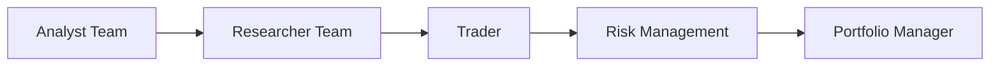
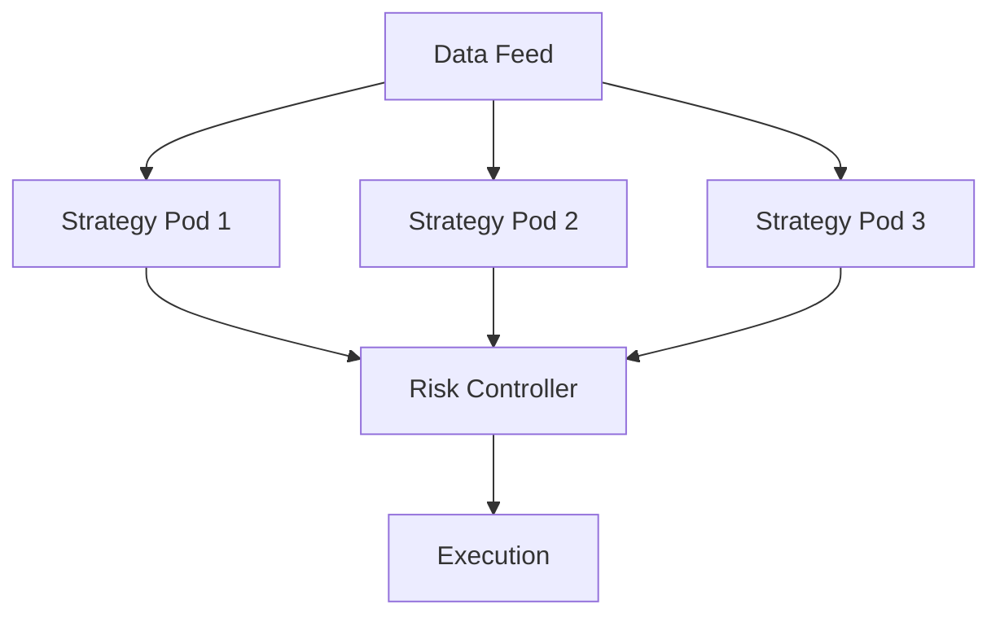
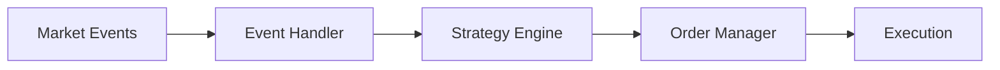
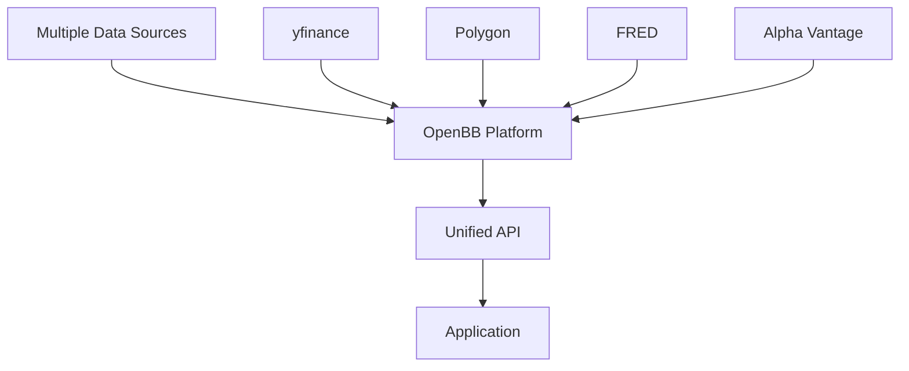
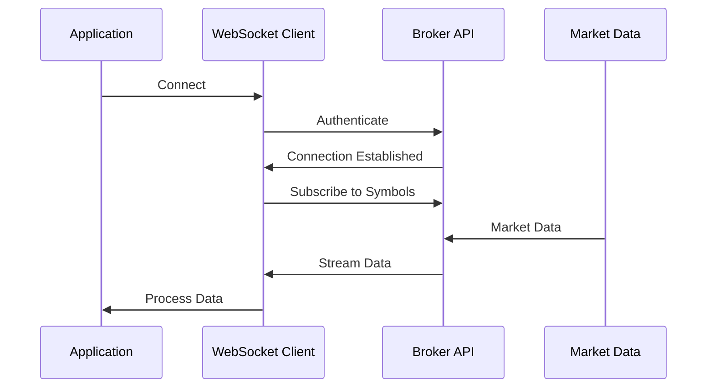
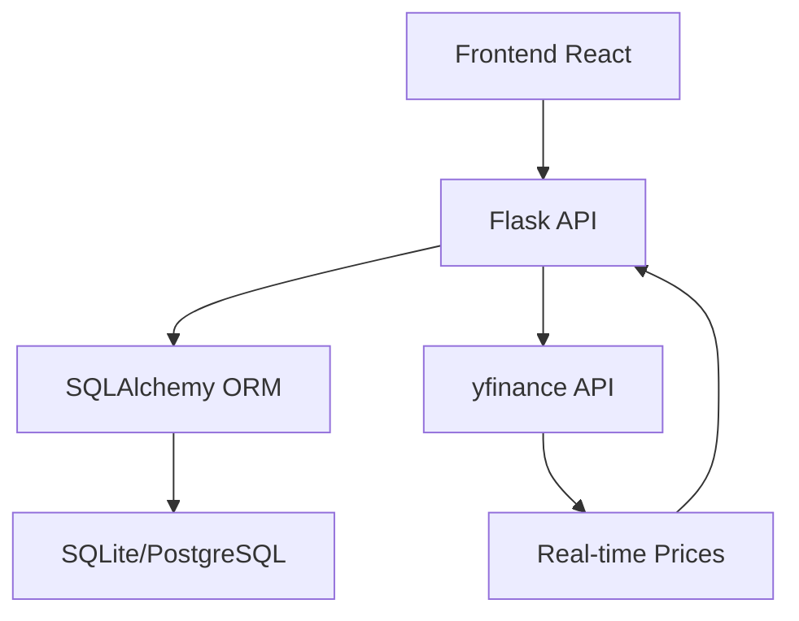

# 交易/量化Agent业界调研报告

## 文档说明

本文档深度调研业界和开源项目中的交易/量化Agent实现方式，分析可复用的开源组件，为TradingAgents项目的前后端分离改造提供参考。

**调研范围**：
- 开源交易Agent框架
- 量化交易平台
- 金融LLM Agent架构
- 前后端实现方案
- 可复用组件库

## 1. 业界开源项目概览

### 1.1 多Agent交易框架

| 项目 | 技术栈 | 特点 | 开源状态 | 适用场景 |
|:----|:------|:----|:--------|:--------|
| **TradingAgents** | LangGraph + Python | 7个专业Agent角色，辩论式决策 | ✅ Apache-2.0 | 多Agent协作交易 |
| **StockSim** | Python | 订单级模拟，多Agent协调 | ✅ 开源 | 交易策略评估 |
| **AgentQuant** | LangChain + LangGraph | 自动化量化研究，Gemini驱动 | ✅ 开源 | 量化策略生成 |
| **Magents** | Python | 对冲基金模拟，多策略并发 | ✅ 开源 | 多策略管理 |
| **APilot** | Python | 事件驱动，高性能执行 | ✅ 开源 | 加密货币/股票交易 |

### 1.2 强化学习交易框架

| 项目 | 技术栈 | 特点 | 开源状态 | 适用场景 |
|:----|:------|:----|:--------|:--------|
| **TensorTrade** | TensorFlow + Gym | 模块化RL环境，可扩展 | ✅ 开源 | RL策略训练 |
| **Hummingbot** | Python | 多交易所支持，31.5B交易量 | ✅ 开源 | 自动化做市 |

### 1.3 金融LLM框架

| 项目 | 技术栈 | 特点 | 开源状态 | 适用场景 |
|:----|:------|:----|:--------|:--------|
| **FinGPT** | PyTorch | 开源金融LLM，数据驱动 | ✅ 开源 | 金融文本理解 |
| **P1GPT** | Multi-Agent LLM | 结构化多Agent推理 | ✅ 开源 | 多模态金融分析 |

## 2. 架构模式分析

### 2.1 多Agent架构模式

#### 模式1: 角色分工模式（TradingAgents采用）



**特点**：
- 明确的角色分工
- 顺序执行流程
- 辩论式决策机制

**适用场景**：需要专业分工和可解释性的场景

#### 模式2: 策略Pod模式（Magents采用）



**特点**：
- 独立策略并发执行
- 统一数据源和风控
- 高并发性能

**适用场景**：多策略并行交易

#### 模式3: 事件驱动模式（APilot采用）



**特点**：
- 事件驱动架构
- 低延迟响应
- 高性能执行

**适用场景**：高频交易、实时响应

### 2.2 前后端架构模式

#### 模式1: 传统前后端分离

| 项目 | 前端 | 后端 | 通信方式 |
|:----|:----|:----|:--------|
| **PortfolioManager** | React | Flask + SQLAlchemy | REST API |
| **Investment Dashboard** | React | Node.js | REST API |
| **CryptoDashe** | React | Express | REST + WebSocket |

**特点**：
- 标准REST API
- 可选WebSocket实时更新
- 技术栈成熟

#### 模式2: 现代实时架构

| 项目 | 前端 | 后端 | 通信方式 |
|:----|:----|:----|:--------|
| **FastAPI Trading App** | React | FastAPI | REST + WebSocket |
| **Binance Demo** | React | FastAPI | WebSocket Streaming |

**特点**：
- FastAPI高性能
- WebSocket实时推送
- 异步处理

## 3. 可复用开源组件

### 3.1 数据获取组件

| 组件 | 功能 | 许可证 | 推荐度 | 说明 |
|:----|:----|:------|:------|:-----|
| **OpenBB** | 金融数据聚合平台 | 开源 | ⭐⭐⭐⭐⭐ | 60.6k stars，支持60+数据源 |
| **yfinance** | Yahoo Finance数据 | MIT | ⭐⭐⭐⭐ | 轻量级，免费 |
| **Alpha Vantage** | 金融数据API | 免费/付费 | ⭐⭐⭐ | 有API限制 |
| **polygon.io** | 实时市场数据 | 免费/付费 | ⭐⭐⭐⭐ | 实时数据支持好 |
| **FRED API** | 宏观经济数据 | 免费 | ⭐⭐⭐⭐ | 美联储数据 |

**推荐方案**：
- **主要数据源**：OpenBB（统一接口，多数据源）
- **备用数据源**：yfinance（免费，稳定）
- **实时数据**：polygon.io或Alpaca WebSocket

### 3.2 交易执行组件

| 组件 | 功能 | 许可证 | 推荐度 | 说明 |
|:----|:----|:------|:------|:-----|
| **alpaca-trade-api** | Alpaca交易接口 | Apache-2.0 | ⭐⭐⭐⭐⭐ | 已集成，支持paper trading |
| **python-binance** | Binance交易接口 | MIT | ⭐⭐⭐⭐ | 加密货币交易 |
| **omspy** | 订单管理系统 | MIT | ⭐⭐⭐ | 订单管理抽象层 |
| **Hummingbot** | 多交易所执行 | Apache-2.0 | ⭐⭐⭐⭐ | 完整的执行引擎 |

**推荐方案**：
- **股票交易**：alpaca-trade-api（已集成）
- **订单管理**：自研（基于现有抽象层）
- **多交易所**：考虑Hummingbot（如需要）

### 3.3 投资组合管理组件

| 组件 | 功能 | 许可证 | 推荐度 | 说明 |
|:----|:----|:------|:------|:-----|
| **PortfolioManager** | 完整投资组合系统 | 开源 | ⭐⭐⭐⭐ | Flask + React，SQLAlchemy |
| **vectorbt** | 回测和投资组合分析 | MIT | ⭐⭐⭐⭐⭐ | 高性能回测 |
| **pyfolio** | 投资组合分析 | Apache-2.0 | ⭐⭐⭐⭐ | 风险指标分析 |
| **skfolio** | 投资组合优化 | BSD | ⭐⭐⭐⭐ | 已集成，优化算法 |

**推荐方案**：
- **数据库模型**：参考PortfolioManager的SQLAlchemy模型
- **回测**：vectorbt（高性能）
- **风险分析**：skfolio + pyfolio（已集成skfolio）

### 3.4 前端组件

| 组件 | 功能 | 许可证 | 推荐度 | 说明 |
|:----|:----|:------|:------|:-----|
| **Ghostfolio** | 财富管理前端 | AGPL-3.0 | ⭐⭐⭐⭐ | 完整的投资组合UI |
| **Stocknear** | 股票分析前端 | 开源 | ⭐⭐⭐ | SvelteKit实现 |
| **PortfolioManager Frontend** | React投资组合UI | 开源 | ⭐⭐⭐⭐ | React + MUI + Nivo |

**推荐方案**：
- **UI框架**：参考PortfolioManager的React实现
- **图表库**：Nivo或ECharts（PortfolioManager使用Nivo）
- **组件库**：Material-UI（MUI）

### 3.5 后端框架组件

| 组件 | 功能 | 许可证 | 推荐度 | 说明 |
|:----|:----|:------|:------|:-----|
| **FastAPI** | 现代Web框架 | MIT | ⭐⭐⭐⭐⭐ | 高性能，自动文档 |
| **LangChain** | LLM应用框架 | MIT | ⭐⭐⭐⭐⭐ | 已集成 |
| **LangGraph** | 状态机工作流 | MIT | ⭐⭐⭐⭐⭐ | 已集成 |
| **SQLAlchemy** | ORM框架 | MIT | ⭐⭐⭐⭐⭐ | 已集成 |

**推荐方案**：
- **API框架**：FastAPI（已准备）
- **工作流**：LangGraph（已集成）
- **数据库**：SQLAlchemy（已集成）

### 3.6 实时通信组件

| 组件 | 功能 | 许可证 | 推荐度 | 说明 |
|:----|:----|:------|:------|:-----|
| **FastAPI WebSocket** | WebSocket支持 | MIT | ⭐⭐⭐⭐⭐ | FastAPI原生支持 |
| **Socket.io** | 实时通信库 | MIT | ⭐⭐⭐ | Node.js生态 |
| **Server-Sent Events** | 单向推送 | 标准 | ⭐⭐⭐ | 简单场景适用 |

**推荐方案**：
- **实时推送**：FastAPI WebSocket（原生支持，性能好）

## 4. 技术栈对比分析

### 4.1 后端技术栈对比

| 项目 | Web框架 | 数据库 | ORM | 任务队列 | 实时通信 |
|:----|:------|:------|:----|:--------|:--------|
| **TradingAgents** | - | PostgreSQL/SQLite | SQLAlchemy | APScheduler | - |
| **PortfolioManager** | Flask | SQLite | SQLAlchemy | - | - |
| **FastAPI Trading** | FastAPI | - | - | - | WebSocket |
| **AgentQuant** | - | - | - | - | - |
| **Magents** | - | - | - | Celery | - |

**推荐技术栈**：
- **Web框架**：FastAPI（高性能，自动文档）
- **数据库**：PostgreSQL（生产环境）+ SQLite（开发）
- **ORM**：SQLAlchemy 2.0（已集成）
- **任务队列**：APScheduler（轻量级）或Celery（分布式）
- **实时通信**：FastAPI WebSocket

### 4.2 前端技术栈对比

| 项目 | 框架 | UI库 | 图表库 | 状态管理 |
|:----|:----|:----|:------|:--------|
| **PortfolioManager** | React | Material-UI | Nivo | - |
| **Investment Dashboard** | React | - | Chart.js | - |
| **Stocknear** | SvelteKit | DaisyUI | - | - |
| **Ghostfolio** | Angular | - | Chart.js | - |

**推荐技术栈**：
- **框架**：React 18+（生态成熟）
- **UI库**：Material-UI或Ant Design
- **图表库**：ECharts或Nivo
- **状态管理**：Zustand（轻量级）

## 5. 架构设计参考

### 5.1 数据流架构（参考OpenBB）



**设计要点**：
- 统一数据接口
- 多数据源聚合
- 缓存机制

### 5.2 实时数据流架构（参考Alpaca/Binance）



**设计要点**：
- WebSocket连接管理
- 自动重连机制
- 数据订阅管理

### 5.3 投资组合管理架构（参考PortfolioManager）



**设计要点**：
- RESTful API设计
- 数据库模型设计（Users, Holdings, Transactions）
- FIFO盈亏计算

## 6. 可复用代码模式

### 6.1 数据库模型模式（参考PortfolioManager）

```python
# 核心模型设计
class Position(Base):
    ticker: str
    quantity: float
    avg_cost: float
    current_price: float
    unrealized_pnl: float

class Transaction(Base):
    ticker: str
    action: str  # BUY/SELL
    quantity: float
    price: float
    timestamp: datetime

class Portfolio(Base):
    total_value: float
    cash: float
    positions_value: float
    total_pnl: float
```

### 6.2 WebSocket连接管理（参考FastAPI Trading）

```python
# 连接管理器模式
class ConnectionManager:
    def __init__(self):
        self.active_connections: List[WebSocket] = []
    
    async def connect(self, websocket: WebSocket):
        await websocket.accept()
        self.active_connections.append(websocket)
    
    async def broadcast(self, message: dict):
        for connection in self.active_connections:
            await connection.send_json(message)
```

### 6.3 实时数据流模式（参考Alpaca/Binance）

```python
# WebSocket数据流模式
async def stream_market_data(symbols: List[str]):
    async with websocket.connect(ws_url) as ws:
        await ws.send(json.dumps({
            "action": "subscribe",
            "symbols": symbols
        }))
        async for message in ws:
            data = json.loads(message)
            await process_market_data(data)
```

## 7. 实施建议

### 7.1 数据层优化

| 优化项 | 当前方案 | 推荐方案 | 理由 |
|:------|:--------|:--------|:-----|
| **数据源** | yfinance + Alpha Vantage | OpenBB + yfinance | 统一接口，多数据源 |
| **数据缓存** | 文件缓存 | Redis缓存 | 性能更好 |
| **实时数据** | 轮询 | WebSocket | 实时性更好 |

### 7.2 后端API优化

| 优化项 | 推荐方案 | 参考项目 |
|:------|:--------|:--------|
| **API框架** | FastAPI | FastAPI Trading App |
| **WebSocket** | FastAPI WebSocket | Binance Demo |
| **数据库模型** | 参考PortfolioManager | PortfolioManager |
| **任务处理** | APScheduler + 异步 | AgentQuant |

### 7.3 前端优化

| 优化项 | 推荐方案 | 参考项目 |
|:------|:--------|:--------|
| **框架** | React | PortfolioManager |
| **UI库** | Material-UI | PortfolioManager |
| **图表** | ECharts或Nivo | PortfolioManager使用Nivo |
| **实时更新** | WebSocket客户端 | FastAPI Trading App |

## 8. 关键发现总结

### 8.1 架构模式

1. **多Agent架构**：TradingAgents的角色分工模式是主流，适合需要可解释性的场景
2. **事件驱动**：高频交易场景使用事件驱动架构
3. **前后端分离**：React + FastAPI是主流组合

### 8.2 技术选型

1. **数据源**：OpenBB是最佳选择（统一接口，多数据源）
2. **后端**：FastAPI + SQLAlchemy + WebSocket
3. **前端**：React + Material-UI + ECharts
4. **实时通信**：WebSocket是标准方案

### 8.3 可复用组件

1. **PortfolioManager**：数据库模型和前端UI设计
2. **FastAPI Trading App**：WebSocket实现模式
3. **OpenBB**：数据源统一接口
4. **vectorbt**：高性能回测（如需要）

### 8.4 最佳实践

1. **数据库设计**：参考PortfolioManager的FIFO盈亏计算
2. **WebSocket管理**：使用连接管理器模式
3. **实时数据**：使用WebSocket而非轮询
4. **API设计**：RESTful + WebSocket混合模式

## 9. 实施优先级

### P0（必须参考）

1. **FastAPI WebSocket实现**：参考FastAPI Trading App
2. **数据库模型设计**：参考PortfolioManager
3. **前端UI设计**：参考PortfolioManager
4. **数据源集成**：考虑OpenBB

### P1（建议参考）

1. **实时数据流**：参考Alpaca/Binance WebSocket实现
2. **投资组合计算**：参考PortfolioManager的FIFO算法
3. **图表可视化**：参考PortfolioManager的Nivo使用

### P2（可选参考）

1. **多策略管理**：参考Magents的Pod模式（如需要）
2. **事件驱动架构**：参考APilot（如需要高频交易）

## 10. 参考资料

### 10.1 开源项目链接

- [TradingAgents](https://github.com/TauricResearch/TradingAgents)
- [StockSim](https://github.com/harrypapa2002/StockSim)
- [AgentQuant](https://github.com/OnePunchMonk/AgentQuant)
- [Magents](https://github.com/llmquant/magents)
- [PortfolioManager](https://github.com/Isaaruwu/PortfolioManager)
- [OpenBB](https://github.com/OpenBB-finance/OpenBB)
- [FastAPI Trading App](https://github.com/42mo/fastapi-trading-app-example)

### 10.2 技术文档

- [FastAPI WebSocket Guide](https://fastapi.tiangolo.com/advanced/websockets/)
- [OpenBB Documentation](https://docs.openbb.co/)
- [Alpaca WebSocket API](https://docs.alpaca.markets/docs/streaming-market-data)

## 11. 总结

### 11.1 核心发现

1. **TradingAgents的架构**：多Agent角色分工模式是业界主流
2. **前后端分离**：React + FastAPI是标准组合
3. **数据源**：OpenBB提供最佳的统一接口
4. **实时通信**：WebSocket是标准方案

### 11.2 推荐方案

基于调研结果，推荐以下技术栈：

**后端**：
- FastAPI（Web框架）
- SQLAlchemy（ORM，已集成）
- FastAPI WebSocket（实时通信）
- OpenBB（数据源统一接口）
- APScheduler（任务调度，已集成）

**前端**：
- React 18+（框架）
- Material-UI或Ant Design（UI库）
- ECharts或Nivo（图表库）
- WebSocket客户端（实时更新）

**参考项目**：
- PortfolioManager（数据库模型和前端UI）
- FastAPI Trading App（WebSocket实现）

### 11.3 下一步行动

1. 深入研究PortfolioManager的数据库模型设计
2. 研究FastAPI Trading App的WebSocket实现
3. 评估OpenBB作为数据源统一接口
4. 设计基于参考项目的前后端架构
